## 2. Architecture DSL (ArchDSL) for Priority Requirements

### MVP Component Diagram

### Component-to-Priority-Requirement Mapping

```mermaid
flowchart TD
    classDef component fill:#e3f2fd,stroke:#333,stroke-width:1px,color:#000000
    classDef funcReq fill:#e1f5fe,stroke:#333,stroke-width:1px,color:#000000
    classDef nonFuncReq fill:#fff9c4,stroke:#333,stroke-width:1px,color:#000000
    classDef security fill:#ffebee,stroke:#333,stroke-width:1px,color:#000000
    
    C1["COMP-001
    Slack Data Collector"]
    C2["COMP-002
    Data Repository"]
    C3["COMP-003
    Conversation Reconstructor"]
    C4["COMP-004
    Embedding Service"]
    C5["COMP-005
    Search Service"]
    C6["COMP-006
    Web Interface"]
    C7["COMP-007
    Topic Analysis Service"]
    C8["COMP-008
    Insights Dashboard"]
    S1["SEC-001
    Auth & Security Service"]
    
    F001["REQ-F001
    Slack Data Collection"]
    F002["REQ-F002
    Conversation Reconstruction"]
    F003["REQ-F003
    Conversation Embedding and Indexing"]
    F004["REQ-F004
    Topic Analysis"]
    F005["REQ-F005
    Basic Semantic Search"]
    F006["REQ-F006
    Basic Insights Dashboard"]
    F007["REQ-F007
    Slack User Information Storage"]
    F008["REQ-F008
    Slack Channel Information Storage"]
    
    NF001["REQ-NF001
    Data Privacy"]
    NF002["REQ-NF002
    Performance"]
    NF004["REQ-NF004
    Security"]
    NF005["REQ-NF005
    Basic Usability"]
    
    C1 -->|"fulfills"| F001
    C1 -->|"fulfills"| F007
    C1 -->|"fulfills"| F008
    C2 -->|"supports"| F001
    C2 -->|"supports"| F003
    C2 -->|"supports"| F004
    C2 -->|"supports"| F007
    C2 -->|"supports"| F008
    C2 -->|"enables"| NF001
    C2 -->|"enables"| NF002
    C3 -->|"fulfills"| F002
    C3 -->|"uses"| F007
    C3 -->|"uses"| F008
    C4 -->|"fulfills"| F003
    C5 -->|"fulfills"| F005
    C5 -->|"uses"| F007
    C5 -->|"uses"| F008
    C6 -->|"exposes"| F005
    C6 -->|"exposes"| F007
    C6 -->|"exposes"| F008
    C6 -->|"enables"| NF005
    C7 -->|"fulfills"| F004
    C8 -->|"fulfills"| F006
    C8 -->|"displays"| F007
    C8 -->|"displays"| F008
    C8 -->|"enables"| NF005
    S1 -->|"fulfills"| NF001
    S1 -->|"fulfills"| NF004
    
    class C1,C2,C3,C4,C5,C6,C7,C8 component
    class S1 security
    class F001,F002,F003,F004,F005,F006,F007,F008 funcReq
    class NF001,NF002,NF004,NF005 nonFuncReq
```

### MVP Deployment View

### Deployment-to-Component Mapping

### Implementation Sequence

### Component Interaction Sequence

This architecture is specifically designed to fulfill the priority requirements from the Requirements DSL, providing a clear roadmap for MVP implementation while ensuring all critical functionality is addressed.
