## 4. Code Mapping DSL (CodeDSL)

### File Structure with Implementation Details

```mermaid
flowchart TD
    classDef folder fill:#e8f5e9,stroke:#333,stroke-width:1px,color:#000000
    classDef file fill:#f1f8e9,stroke:#333,stroke-width:1px,color:#000000
    classDef module fill:#e3f2fd,stroke:#333,stroke-width:1px,color:#000000

    App["/app
    ---
    Main application directory"]
    SC["/slack_collector
    ---
    Slack data collection module
    Implements MOD-001"]
    DB["/database
    ---
    Database access layer
    Implements MOD-002"]
    Conv["/conversation
    ---
    Conversation processing
    Implements MOD-003"]
    Emb["/embedding
    ---
    Text embedding generation
    Implements MOD-004"]
    Top["/topics
    ---
    Topic analysis
    Implements MOD-005"]
    Search["/search
    ---
    Semantic search functionality
    Implements MOD-006"]
    Dash["/dashboard
    ---
    Insights dashboard
    Implements MOD-007"]
    Utils["/utils
    ---
    Shared utility functions"]
    
    App --> SC
    App --> DB
    App --> Conv
    App --> Emb
    App --> Top
    App --> Search
    App --> Dash
    App --> Utils
    
    SC --> Client["client.py
    ---
    Slack API client implementation
    Implements FUNC-001: initialize_client"]
    SC --> Collector["collector.py
    ---
    Data collection functions
    Implements FUNC-002/003/004/005"]
    
    DB --> Connection["connection.py
    ---
    Database connection management
    Implements FUNC-006"]
    DB --> Storage["storage.py
    ---
    Data storage operations
    Implements FUNC-007/008/009/010"]
    DB --> VectorStore["vector_store.py
    ---
    Vector storage and retrieval
    Implements FUNC-011/012"]
    
    Conv --> Reconstruct["reconstruction.py
    ---
    Thread and conversation reconstruction
    Implements FUNC-013/014/015/016"]
    
    Emb --> Models["models.py
    ---
    Embedding model configuration
    Implements FUNC-017"]
    Emb --> Processor["processor.py
    ---
    Text preprocessing for embeddings
    Implements FUNC-018/019"]
    Emb --> Generator["generator.py
    ---
    Embedding generation functions
    Implements FUNC-020/021"]
    
    Top --> Clustering["clustering.py
    ---
    Embedding clustering
    Implements FUNC-022/023"]
    Top --> Labeling["labeling.py
    ---
    Topic labeling
    Implements FUNC-024"]
    Top --> Evolution["evolution.py
    ---
    Topic evolution tracking
    Implements FUNC-025"]
    
    Search --> Query["query.py
    ---
    Query processing
    Implements FUNC-026/027"]
    Search --> Engine["engine.py
    ---
    Search execution
    Implements FUNC-028/029"]
    
    Dash --> Charts["charts.py
    ---
    Chart generation
    Implements FUNC-030/031/033"]
    Dash --> Results["results.py
    ---
    Search result formatting
    Implements FUNC-032"]
    
    Utils --> Types["types.py
    ---
    Shared type definitions
    Implements TYPE-001/002/003/004/005"]
    
    class App,SC,DB,Conv,Emb,Top,Search,Dash,Utils folder
    class Client,Collector,Connection,Storage,VectorStore,Reconstruct,Models,Processor,Generator,Clustering,Labeling,Evolution,Query,Engine,Charts,Results,Types file
```



### Code Fragment Example

```mermaid
flowchart TD
    classDef code fill:#f5f5f5,stroke:#333,stroke-width:1px,color:#000000
    
    FRAG1["FRAG-001
    ---
    File: /app/slack_collector/client.py
    Implements: FUNC-001"]
    
    CODE1["def initialize_client(slack_token):
        \"\"\"Set up authenticated Slack API client\"\"\"
        from slack_sdk import WebClient
        return WebClient(token=slack_token)"]
    
    FRAG3["FRAG-003
    ---
    File: /app/database/vector_store.py
    Implements: FUNC-012"]
    
    CODE3["def query_vector_similarity(query_vector, 
                                filter_conditions=None, 
                                limit=10, 
                                connection=None):
        \"\"\"Find similar vectors using cosine similarity\"\"\"
        conn = connection or initialize_db_connection(...)
        
        # Base query
        query = \"SELECT id, content, metadata, 
                embedding <-> :query AS distance\"
        params = {\"query\": query_vector}
        
        # Add filters if provided
        if filter_conditions:
            where_clauses = []
            for key, value in filter_conditions.items():
                where_clauses.append(f\"metadata->>'{key}' = :filter_{i}\")
            
            query += \" WHERE \" + \" AND \".join(where_clauses)
        
        # Return results
        return conn.query(query, params).execute().data"]
    
    FRAG1 --- CODE1
    FRAG3 --- CODE3
    
    class FRAG1,FRAG3 code
    class CODE1,CODE3 code
```
