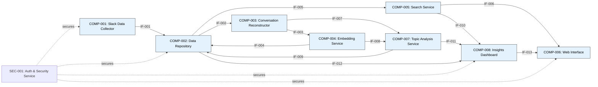

# Component Design Specification (CompDSL)

This document provides detailed specifications for each component in the Slack Conversation Analyzer system, including internal structure, interfaces, behaviors, and communication mechanisms.

## Table of Contents
1. [Component Overview](#component-overview)
2. [Detailed Component Specifications](#detailed-component-specifications)
3. [Interface Definitions](#interface-definitions)
4. [Communication Patterns](#communication-patterns)
5. [Data Schemas](#data-schemas)

## Component Overview



## Detailed Component Specifications

### COMP-001: Slack Data Collector

**Type**: Service Component

**Internal Structure**:
- `SlackAuthenticator`: Manages OAuth authentication with Slack API
- `MessageCollector`: Retrieves messages from public channels
- `UserProfileCollector`: Retrieves user profile information
- `ChannelInfoCollector`: Retrieves channel information
- `RateLimitManager`: Handles Slack API rate limiting
- `DataPersister`: Persists collected data to the Data Repository

**Behavior**:
- Runs on a scheduled basis (15-minute intervals for messages, daily for users/channels)
- Supports manual refresh of user/channel data
- Implements incremental collection to minimize API usage

**State Management**:
- Tracks last collection timestamp per channel
- Stores OAuth tokens securely
- Maintains rate limit status

**Error Handling**:
- Retries failed API calls with exponential backoff
- Logs collection errors
- Reports collection status to monitoring service

**Technology Stack**:
- Language: Python
- Libraries: slack_sdk, requests, schedule
- Configuration: YAML-based configuration

### COMP-002: Data Repository

**Type**: Data Store Component

**Internal Structure**:
- `MessageStore`: Stores raw messages and metadata
- `UserStore`: Stores user profiles and metadata
- `ChannelStore`: Stores channel information
- `EmbeddingStore`: Stores vector embeddings
- `TopicStore`: Stores topic metadata
- `QueryEngine`: Provides optimized query interfaces

**Behavior**:
- Implements ACID transactions for data integrity
- Enforces access controls based on security policies
- Provides efficient retrieval of related data

**State Management**:
- Manages data versioning
- Implements data retention policies
- Handles data consistency

**Error Handling**:
- Logs database errors
- Implements connection retries
- Handles transaction rollbacks

**Technology Stack**:
- PostgreSQL with pgvector extension
- Connection pooling
- Prepared statements for efficiency

### COMP-003: Conversation Reconstructor

**Type**: Processing Component

**Internal Structure**:
- `ThreadGrouper`: Groups messages into conversation threads
- `SequentialMessageGrouper`: Groups sequential messages by same user
- `TopicClusterer`: Implements basic topic clustering
- `MentionResolver`: Resolves user and channel mentions
- `ConversationUnitBuilder`: Creates logical conversation units

**Behavior**:
- Processes messages in batches
- Applies configurable time windows for message grouping
- Preserves conversation context and chronology

**State Management**:
- Tracks processed message IDs
- Maintains thread state during processing

**Error Handling**:
- Logs processing errors
- Implements partial processing to handle failures

**Technology Stack**:
- Python
- NLP libraries (NLTK/spaCy)
- Clustering algorithms

### COMP-004: Embedding Service

**Type**: Processing Component

**Internal Structure**:
- `TextPreprocessor`: Cleans and normalizes conversation text
- `EmbeddingGenerator`: Generates vector embeddings
- `BatchProcessor`: Handles batch processing of conversations
- `EmbeddingPersister`: Stores embeddings in the Data Repository

**Behavior**:
- Processes conversations in batches to optimize API usage
- Uses cost-effective embedding models
- Implements batched persistence of embeddings

**State Management**:
- Tracks processed conversation units
- Manages embedding model versioning

**Error Handling**:
- Retries failed embedding generation
- Logs embedding errors
- Implements circuit breaker for external API calls

**Technology Stack**:
- Python
- OpenAI API / SentenceTransformers
- Vector manipulation libraries

### COMP-005: Search Service

**Type**: Service Component

**Internal Structure**:
- `QueryProcessor`: Processes search queries
- `EmbeddingConverter`: Converts queries to embeddings
- `VectorSearcher`: Performs vector similarity search
- `FilterApplier`: Applies channel and date filters
- `ResultsBuilder`: Builds search results with context

**Behavior**:
- Converts text queries to vector embeddings
- Performs efficient vector similarity search
- Applies post-processing filters (channel, date, etc.)
- Returns ranked results with conversation context

**State Management**:
- Caches recent search results
- Tracks search history

**Error Handling**:
- Handles malformed queries
- Provides fallback search methods
- Times out long-running searches

**Technology Stack**:
- Python
- Vector similarity algorithms
- Filtering engine

### COMP-006: Web Interface

**Type**: Presentation Component

**Internal Structure**:
- `AuthenticationManager`: Handles user authentication
- `SearchInterface`: Presents search interface
- `ResultsDisplay`: Displays search results
- `TopicVisualizer`: Shows topic visualizations
- `FilterController`: Provides filtering controls
- `UserProfileDisplay`: Displays user information
- `ChannelInfoDisplay`: Displays channel information
- `RefreshController`: Provides manual refresh controls

**Behavior**:
- Authenticates users securely
- Presents intuitive search and visualization interfaces
- Renders conversation context with user/channel information

**State Management**:
- Manages user session
- Stores UI preferences
- Caches UI data

**Error Handling**:
- Handles API errors gracefully
- Provides clear error messages
- Implements retry mechanisms for temporary failures

**Technology Stack**:
- React or Vue.js frontend
- Responsive design
- D3.js for visualizations

### COMP-007: Topic Analysis Service

**Type**: Processing Component

**Internal Structure**:
- `TopicIdentifier`: Identifies main conversation topics
- `TopicDistributor`: Calculates topic distribution
- `DiscussionCategorizer`: Categorizes discussions by topic
- `MetadataGenerator`: Generates topic metadata
- `TrendTracker`: Tracks topic trends over time

**Behavior**:
- Analyzes conversations to extract topics
- Applies topic modeling techniques
- Tracks topic changes over time

**State Management**:
- Maintains topic model state
- Tracks topic evolution

**Error Handling**:
- Logs analysis errors
- Implements fallback categorization

**Technology Stack**:
- Python
- NLP libraries
- Topic modeling algorithms (LDA, BERTopic)

### COMP-008: Insights Dashboard

**Type**: Presentation Component

**Internal Structure**:
- `TopicVisualizer`: Displays topic distributions
- `TrendVisualizer`: Shows activity trends
- `SearchInterface`: Provides search functionality
- `ContextPresenter`: Presents conversation contexts
- `FilterController`: Supports filtering by channel and date
- `VisualizationIntegrator`: Integrates all visualizations

**Behavior**:
- Presents interactive visualizations of topics and trends
- Allows filtering and exploration of data
- Integrates search functionality

**State Management**:
- Stores dashboard state
- Caches visualization data

**Error Handling**:
- Handles visualization errors gracefully
- Provides clear error messages

**Technology Stack**:
- React or Vue.js
- D3.js or Chart.js for visualizations
- WebSockets for real-time updates

### SEC-001: Auth & Security Service

**Type**: Security Component

**Internal Structure**:
- `AuthenticationManager`: Manages user authentication
- `AccessController`: Enforces access controls
- `EncryptionManager`: Implements encryption
- `AuditLogger`: Audits sensitive data access
- `APISecurityManager`: Secures API endpoints

**Behavior**:
- Authenticates users securely
- Enforces role-based access control
- Encrypts sensitive data
- Logs security events

**State Management**:
- Manages authentication tokens
- Tracks user sessions
- Stores security configuration

**Error Handling**:
- Logs security violations
- Implements account lockouts for suspicious activity

**Technology Stack**:
- OAuth 2.0 / JWT
- TLS encryption
- Access control lists

## Interface Definitions

### IF-001: Collected Data Stream
**Type**: REST API
**Description**: Provides raw Slack data from Collector to Repository
**Methods**:
- `POST /api/messages/batch`: Submit batch of collected messages
- `POST /api/users/batch`: Submit batch of collected user profiles
- `POST /api/channels/batch`: Submit batch of collected channel info
**Request Format**: JSON batch payload
**Response Format**: Status, success count, failed IDs

### IF-002: Data Access Layer
**Type**: Database Interface
**Description**: Provides secure CRUD operations for data access
**Methods**:
- `getMessages(filters)`: Retrieve messages based on filters
- `getUsers(filters)`: Retrieve user profiles
- `getChannels(filters)`: Retrieve channel information
- `getConversationUnits(filters)`: Retrieve conversation units
**Request Format**: SQL/ORM query
**Response Format**: Result set

### IF-003: Reconstructed Conversations
**Type**: Message Queue
**Description**: Provides structured conversation units for embedding
**Methods**:
- `pushConversationBatch(conversations)`: Push batch of conversations
- `pullConversationBatch(batchSize)`: Pull batch for processing
**Message Format**: JSON with conversation structure
**Queue Properties**: Persistent, guaranteed delivery

### IF-004: Conversation Embeddings
**Type**: REST API
**Description**: Provides vector representations back to Repository
**Methods**:
- `POST /api/embeddings/batch`: Submit batch of generated embeddings
**Request Format**: JSON with conversation IDs and vector data
**Response Format**: Status, success count, failed IDs

### IF-005: Data Retrieval
**Type**: GraphQL API
**Description**: Provides conversation and embedding data to Search
**Schema Elements**:
- `query conversationsByVector(embedding, filters, limit)`
- `query conversationsByText(text, filters, limit)`
- `query conversationContext(conversationId)`
**Request Format**: GraphQL query
**Response Format**: GraphQL structured response

### IF-006: Search Results
**Type**: REST API
**Description**: Provides relevant conversations to Web Interface
**Methods**:
- `GET /api/search`: Perform search with parameters
**Request Format**: Query parameters (q, filters, page, limit)
**Response Format**: JSON with results and pagination

### IF-007: Conversation Units
**Type**: Message Queue
**Description**: Provides structured conversations to Topic Analysis
**Methods**: Same as IF-003 but different subscribers
**Message Format**: JSON with conversation structure
**Queue Properties**: Persistent, guaranteed delivery

### IF-008: Conversation Embeddings
**Type**: REST API
**Description**: Provides semantic representations to Topic Analysis
**Methods**:
- `GET /api/embeddings/batch`: Retrieve embeddings by conversation IDs
**Request Format**: Query parameters with conversation IDs
**Response Format**: JSON with embeddings

### IF-009: Topic Metadata
**Type**: REST API
**Description**: Provides topic distributions to Repository
**Methods**:
- `POST /api/topics/batch`: Submit batch of topic metadata
**Request Format**: JSON with conversation IDs and topic data
**Response Format**: Status, success count, failed IDs

### IF-010: Search Results
**Type**: REST API
**Description**: Provides relevant conversations to Dashboard
**Methods**: Same as IF-006, different client
**Request Format**: Query parameters
**Response Format**: JSON with results

### IF-011: Topic Visualizations
**Type**: REST API
**Description**: Provides topic distributions to Dashboard
**Methods**:
- `GET /api/topics/distribution`: Get topic distribution
- `GET /api/topics/trends`: Get topic trends over time
**Request Format**: Query parameters (filters, timeRange)
**Response Format**: JSON with topic data

### IF-012: Activity Data
**Type**: REST API
**Description**: Provides usage statistics to Dashboard
**Methods**:
- `GET /api/activity/channels`: Get activity by channel
- `GET /api/activity/time`: Get activity over time
**Request Format**: Query parameters (timeRange)
**Response Format**: JSON with activity data

### IF-013: Dashboard Interface
**Type**: Web Components
**Description**: Provides integrated visualization to Web UI
**Methods**:
- React/Vue components for embedding in Web Interface
**Communication**: Props/events between components

## Communication Patterns

### API-Based Communication
- **REST APIs**: Used for stateless, request-response interactions
  - Authentication: JWT tokens in Authorization header
  - Content Type: Application/JSON
  - Rate Limiting: Implemented at API gateway
  - Documentation: OpenAPI/Swagger

### Message Queue Communication
- **Message Broker**: RabbitMQ or similar
  - Exchange Types: Topic and Direct exchanges
  - Message Persistence: Enabled for critical data
  - Acknowledgements: Required for processing guarantee
  - Error Queues: Dead letter queues for failed messages

### Database Communication
- **Data Access Patterns**:
  - Connection Pooling: For efficient resource usage
  - Prepared Statements: For performance and security
  - Transactions: For data integrity
  - Read/Write Splitting: For performance optimization

### Real-time Communication
- **WebSockets**:
  - Used for dashboard updates
  - Event-based notifications
  - Efficient bi-directional communication

## Data Schemas

### Message Schema
```json
{
  "message_id": "string",
  "channel_id": "string",
  "user_id": "string",
  "text": "string",
  "timestamp": "datetime",
  "thread_ts": "datetime|null",
  "reply_count": "integer|null",
  "reactions": [
    {
      "name": "string",
      "count": "integer",
      "users": ["string"]
    }
  ],
  "attachments": ["object"],
  "metadata": {
    "is_processed": "boolean",
    "processing_timestamp": "datetime|null"
  }
}
```

### User Schema
```json
{
  "user_id": "string",
  "team_id": "string",
  "name": "string",
  "real_name": "string",
  "display_name": "string",
  "email": "string",
  "avatar_url": "string",
  "is_admin": "boolean",
  "is_bot": "boolean",
  "updated": "datetime"
}
```

### Channel Schema
```json
{
  "channel_id": "string",
  "name": "string",
  "is_private": "boolean",
  "created": "datetime",
  "creator": "string",
  "topic": {
    "value": "string",
    "creator": "string",
    "last_set": "datetime"
  },
  "purpose": {
    "value": "string",
    "creator": "string",
    "last_set": "datetime"
  },
  "num_members": "integer",
  "updated": "datetime"
}
```

### Conversation Unit Schema
```json
{
  "conversation_id": "string",
  "channel_id": "string",
  "thread_ts": "datetime|null",
  "start_ts": "datetime",
  "end_ts": "datetime",
  "participants": ["string"],
  "primary_user": "string",
  "message_count": "integer",
  "messages": ["message_id"],
  "is_thread": "boolean",
  "text_content": "string",
  "mentioned_users": ["string"],
  "mentioned_channels": ["string"],
  "created": "datetime"
}
```

### Embedding Schema
```json
{
  "embedding_id": "string",
  "conversation_id": "string",
  "model": "string",
  "dimensions": "integer",
  "vector": "float[]",
  "created": "datetime"
}
```

### Topic Schema
```json
{
  "topic_id": "string",
  "name": "string",
  "keywords": ["string"],
  "confidence": "float",
  "created": "datetime",
  "updated": "datetime"
}
```

### Topic Distribution Schema
```json
{
  "conversation_id": "string",
  "topics": [
    {
      "topic_id": "string",
      "weight": "float"
    }
  ],
  "created": "datetime"
}
```

This Component Design Specification provides a comprehensive view of each component's internal structure, behavior, and interactions, ensuring clear separation of concerns and well-defined communication patterns for the Slack Conversation Analyzer system. 