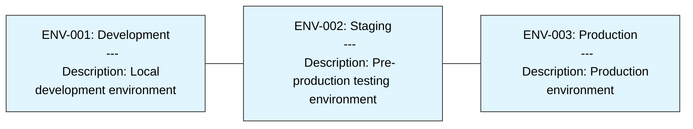
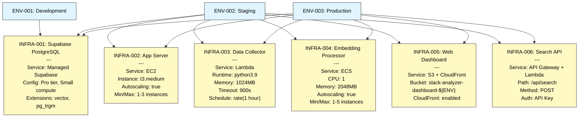
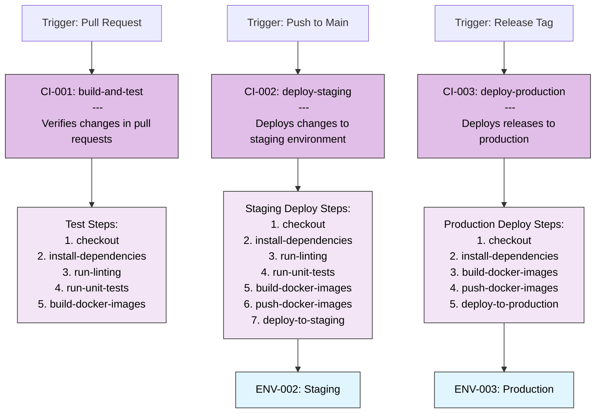

## 5. Deployment DSL (DeployDSL)

### Environment Configuration

### Infrastructure Components with Configuration

### Service Deployment Details

```mermaid
flowchart TD
    classDef service fill:#e8f5e9,stroke:#333,stroke-width:1px,color:#000000
    classDef infra fill:#fff9c4,stroke:#333,stroke-width:1px,color:#000000
    classDef component fill:#e3f2fd,stroke:#333,stroke-width:1px,color:#000000

    S1["SVC-001: slack-collector-service
    ---
    Type: Scheduled Lambda Function
    Docker: slack-analyzer/collector:latest
    Env Vars: SLACK_BOT_TOKEN, SUPABASE_URL, SUPABASE_KEY"]
    
    S2["SVC-002: embedding-service
    ---
    Type: Container Service
    Docker: slack-analyzer/embedding:latest
    Env Vars: OPENAI_API_KEY, SUPABASE_URL, SUPABASE_KEY"]
    
    S3["SVC-003: analysis-service
    ---
    Type: EC2 Application
    Systemd Service: slack-analyzer
    Docker Compose: true
    Env Vars: SUPABASE_URL, SUPABASE_KEY"]
    
    S4["SVC-004: search-api-service
    ---
    Type: API Gateway Lambda
    Docker: slack-analyzer/search-api:latest
    Env Vars: SUPABASE_URL, SUPABASE_KEY"]
    
    S5["SVC-005: dashboard-ui
    ---
    Type: Static Website
    Build Command: npm run build
    Source: /dashboard
    Output: /dashboard/build
    Env Vars: REACT_APP_API_URL"]
    
    C1["COMP-001: Slack Data Collector"]
    C4["COMP-004: Embedding Engine"]
    C3_5["COMP-003/005: Conversation Reconstructor & Topic Analyzer"]
    C6["COMP-006: Search Engine"]
    C7["COMP-007: Insight Dashboard"]
    
    I3["INFRA-003: Lambda Data Collector"]
    I4["INFRA-004: ECS Embedding Processor"]
    I2["INFRA-002: EC2 App Server"]
    I6["INFRA-006: API Gateway + Lambda"]
    I5["INFRA-005: S3 + CloudFront"]
    
    S1 -->|"implements"| C1
    S2 -->|"implements"| C4
    S3 -->|"implements"| C3_5
    S4 -->|"implements"| C6
    S5 -->|"implements"| C7
    
    S1 -->|"deployed to"| I3
    S2 -->|"deployed to"| I4
    S3 -->|"deployed to"| I2
    S4 -->|"deployed to"| I6
    S5 -->|"deployed to"| I5
    
    class S1,S2,S3,S4,S5 service
    class C1,C4,C3_5,C6,C7 component
    class I3,I4,I2,I6,I5 infra
```

### CI/CD Workflow with Steps

These enhanced diagrams provide a more detailed visual representation of the Slack Analyzer system, including descriptions, responsibilities, configurations, and other important details from the original textual DSLs.
