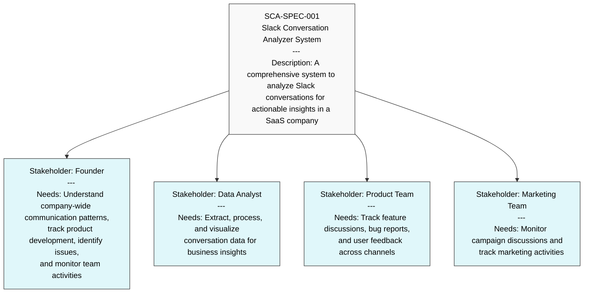
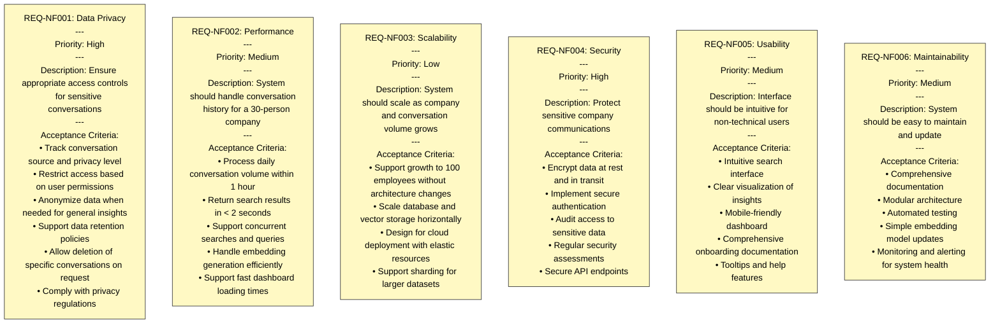
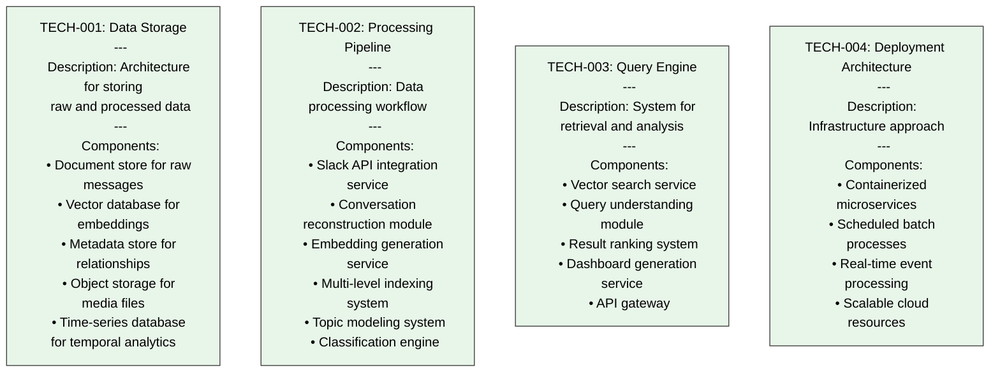

# Slack Conversation Analyzer Requirements

## 1. Full Requirements DSL

### System Specification

```mermaid
flowchart TD
    classDef reqClass fill:#f9f9f9,stroke:#333,stroke-width:1px,color:#000000
    classDef stakeholderClass fill:#e0f7fa,stroke:#333,stroke-width:1px,color:#000000

    Spec["SCA-SPEC-001
    Slack Conversation Analyzer System
    ---
    Description: A comprehensive system to analyze Slack 
    conversations for actionable insights in a SaaS company"] 
    
    Founder["Stakeholder: Founder
    ---
    Needs: Understand company-wide communication patterns,
    track product development, identify issues,
    and monitor team activities"]
    
    Analyst["Stakeholder: Data Analyst
    ---
    Needs: Extract, process, and visualize
    conversation data for business insights"]
    
    ProductTeam["Stakeholder: Product Team
    ---
    Needs: Track feature discussions, bug reports,
    and user feedback across channels"]
    
    MarketingTeam["Stakeholder: Marketing Team
    ---
    Needs: Monitor campaign discussions and
    track marketing activities"]
    
    Spec --> Founder
    Spec --> Analyst
    Spec --> ProductTeam
    Spec --> MarketingTeam
    
    class Spec reqClass
    class Founder,Analyst,ProductTeam,MarketingTeam stakeholderClass
```

### Functional Requirements

```mermaid
flowchart TD
    classDef funcReq fill:#e1f5fe,stroke:#333,stroke-width:1px,color:#000000

    F001["REQ-F001: Slack Data Collection
    ---
    Priority: High
    ---
    Description: Collect and store raw message data
    from all relevant Slack channels
    ---
    Acceptance Criteria:
    • Collect messages from all Slack communications (public channels, 
      private channels, direct messages, and group chats)
    • Enforce appropriate permissions and access controls for private 
      channels, DMs, and group chats based on user access rights
    • Store message metadata (author, timestamp, reactions)
    • Store files and media shared on slack on S3
    • Handle rate limiting from Slack API
    • Support incremental updates and backfilling historical data
    • Process and make new messages available within minutes of creation for near real-time insights"] 
    
    F002["REQ-F002: Conversation Reconstruction
    ---
    Priority: Medium
    ---
    Description: Reconstruct coherent conversations
    from individual messages across various contexts
    ---
    Acceptance Criteria:
    • Reconstruct thread-based conversations (parent message with all replies)
    • Group sequential messages by the same person within a defined time window
    • Identify topic-based conversation clusters even when not in formal threads
    • Detect conversation boundaries based on topic shifts
    • Maintain chronological ordering within conversations
    • Track cross-channel conversations when discussions move between channels
    • Link messages that explicitly reference earlier messages
    • Identify question-answer patterns in non-threaded discussions
    • Group semantically similar messages that form a logical conversation
    • Recognize continued conversations across time periods"]
    
    F003["REQ-F003: Conversation Embedding and Indexing
    ---
    Priority: High
    ---
    Description: Generate vector embeddings and indexes
    of messages and conversations at multiple granularity levels
    ---
    Acceptance Criteria:
    • Generate embeddings at message level for granular search
    • Generate embeddings at conversation level for context awareness
    • Generate embeddings at daily channel summary level
    • Create weekly channel and cross-channel topic summaries with embeddings
    • Create monthly trend analysis summaries with embeddings
    • Create quarterly business insights summaries with embeddings
    • Create annual retrospective summaries with embeddings
    • Implement hierarchical indexing to navigate between granularity levels
    • Use state-of-the-art embedding models (e.g., OpenAI text-embedding-3-large)
    • Support efficient retrieval through optimized indexes
    • Support updating embeddings when models improve
    • Implement appropriate chunking strategies for large conversations"]
    
    F004["REQ-F004: Topic Analysis
    ---
    Priority: Medium
    ---
    Description: Identify common topics being
    discussed across channels
    ---
    Acceptance Criteria:
    • Identify topics without predefined categories
    • Show topic distribution across channels
    • Track topic evolution over time
    • Identify emerging vs. recurring topics
    • Categorize discussions (product, bugs, marketing, etc.)
    • Detect sentiment around topics"]
    
    F005["REQ-F005: Semantic Search
    ---
    Priority: High
    ---
    Description: Allow searching for conversations
    by concept, not just keywords
    ---
    Acceptance Criteria:
    • Return relevant results without exact terms
    • Rank results by relevance
    • Filter by channel, date range, user
    • Support natural language queries
    • Show context around matched conversations
    • Provide search suggestions"]
    
    F006["REQ-F006: Insight Dashboard
    ---
    Priority: Medium
    ---
    Description: Provide visualization of
    conversation insights
    ---
    Acceptance Criteria:
    • Show activity trends over time
    • Highlight emerging topics
    • Display key metrics (active channels, discussion trends)
    • Provide custom reporting options
    • Support automated insights generation"]
    
    F007["REQ-F007: Notification System
    ---
    Priority: Low
    ---
    Description: Alert users about important 
    topics or trends
    ---
    Acceptance Criteria:
    • Set up custom alerts for specific topics
    • Deliver notifications via email or Slack
    • Allow customization of notification frequency
    • Support threshold-based alerting"]
    
    F008["REQ-F008: Conversation Classification
    ---
    Priority: Low
    ---
    Description: Automatically categorize conversations
    into predefined business categories
    ---
    Acceptance Criteria:
    • Classify as product updates, bug reports, features, etc.
    • Allow manual correction of classifications
    • Train models with user feedback
    • Generate regular classification reports"]
    
    F009["REQ-F009: User Participation Analysis
    ---
    Priority: Low
    ---
    Description: Analyze participation patterns
    across teams and channels
    ---
    Acceptance Criteria:
    • Track user engagement levels
    • Identify communication silos
    • Show cross-team collaboration statistics
    • Respect privacy and avoid individual performance metrics"]
    
    F010["REQ-F010: Export and Integration
    ---
    Priority: Low
    ---
    Description: Export data and insights to
    other business systems
    ---
    Acceptance Criteria:
    • Export to CSV, JSON formats
    • API endpoints for integration
    • Scheduled export capabilities
    • Integration with BI tools"]
    
    F001 -->|"dependency"| F002
    F001 -->|"dependency"| F003
    F002 -->|"dependency"| F003
    F003 -->|"dependency"| F004
    F003 -->|"dependency"| F005
    F004 -->|"dependency"| F006
    F004 -->|"dependency"| F007
    F004 -->|"dependency"| F008
    F005 -->|"dependency"| F006
    F006 -->|"dependency"| F010
    F008 -->|"dependency"| F009
    
    class F001,F002,F003,F004,F005,F006,F007,F008,F009,F010 funcReq
```

### Non-Functional Requirements

```mermaid
flowchart TD
    classDef nonFuncReq fill:#fff9c4,stroke:#333,stroke-width:1px,color:#000000
    
    NF001["REQ-NF001: Data Privacy
    ---
    Priority: High
    ---
    Description: Ensure appropriate access controls
    for sensitive conversations
    ---
    Acceptance Criteria:
    • Track conversation source and privacy level
    • Restrict access based on user permissions
    • Anonymize data when needed for general insights
    • Support data retention policies
    • Allow deletion of specific conversations on request
    • Comply with privacy regulations"]
    
    NF002["REQ-NF002: Performance
    ---
    Priority: Medium
    ---
    Description: System should handle conversation
    history for a 30-person company
    ---
    Acceptance Criteria:
    • Process daily conversation volume within 1 hour
    • Return search results in < 2 seconds
    • Support concurrent searches and queries
    • Handle embedding generation efficiently
    • Support fast dashboard loading times"]
    
    NF003["REQ-NF003: Scalability
    ---
    Priority: Low
    ---
    Description: System should scale as company
    and conversation volume grows
    ---
    Acceptance Criteria:
    • Support growth to 100 employees without architecture changes
    • Scale database and vector storage horizontally
    • Design for cloud deployment with elastic resources
    • Support sharding for larger datasets"]
    
    NF004["REQ-NF004: Security
    ---
    Priority: High
    ---
    Description: Protect sensitive company communications
    ---
    Acceptance Criteria:
    • Encrypt data at rest and in transit
    • Implement secure authentication
    • Audit access to sensitive data
    • Regular security assessments
    • Secure API endpoints"]
    
    NF005["REQ-NF005: Usability
    ---
    Priority: Medium
    ---
    Description: Interface should be intuitive for
    non-technical users
    ---
    Acceptance Criteria:
    • Intuitive search interface
    • Clear visualization of insights
    • Mobile-friendly dashboard
    • Comprehensive onboarding documentation
    • Tooltips and help features"]
    
    NF006["REQ-NF006: Maintainability
    ---
    Priority: Medium
    ---
    Description: System should be easy to maintain
    and update
    ---
    Acceptance Criteria:
    • Comprehensive documentation
    • Modular architecture
    • Automated testing
    • Simple embedding model updates
    • Monitoring and alerting for system health"]
    
    class NF001,NF002,NF003,NF004,NF005,NF006 nonFuncReq
```

### Technical Architecture

```mermaid
flowchart TD
    classDef techArch fill:#e8f5e9,stroke:#333,stroke-width:1px,color:#000000
    
    T001["TECH-001: Data Storage
    ---
    Description: Architecture for storing
    raw and processed data
    ---
    Components:
    • Document store for raw messages
    • Vector database for embeddings
    • Metadata store for relationships
    • Object storage for media files
    • Time-series database for temporal analytics"]
    
    T002["TECH-002: Processing Pipeline
    ---
    Description: Data processing workflow
    ---
    Components:
    • Slack API integration service
    • Conversation reconstruction module
    • Embedding generation service
    • Multi-level indexing system
    • Topic modeling system
    • Classification engine"]
    
    T003["TECH-003: Query Engine
    ---
    Description: System for retrieval and analysis
    ---
    Components:
    • Vector search service
    • Query understanding module
    • Result ranking system
    • Dashboard generation service
    • API gateway"]
    
    T004["TECH-004: Deployment Architecture
    ---
    Description: Infrastructure approach
    ---
    Components:
    • Containerized microservices
    • Scheduled batch processes
    • Real-time event processing
    • Scalable cloud resources"]
    
    class T001,T002,T003,T004 techArch
```

