# Functional DSL (FuncDSL)

This document provides detailed functional specifications for each module in the Slack Conversation Analyzer system, including function definitions, interfaces, and dependencies.

## Table of Contents
1. [Module Structure](#module-structure)
2. [Module Dependencies](#module-dependencies)
3. [Interface Implementations](#interface-implementations)
4. [Module Functions](#module-functions)
5. [Shared Types](#shared-types)
6. [API Endpoints](#api-endpoints)
7. [Component Dependency Graph](#component-dependency-graph)

## Module Structure

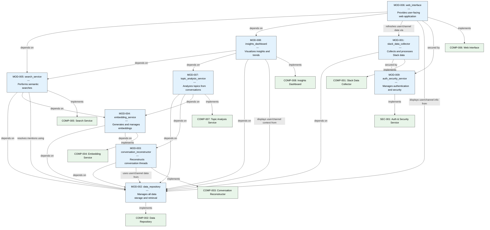

## Module Dependencies

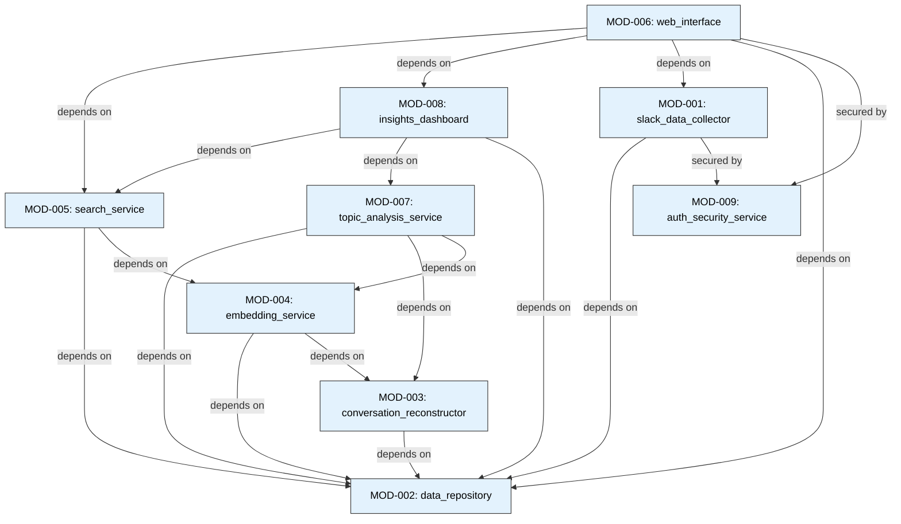

## Interface Implementations

```mermaid
flowchart TD
    classDef module fill:#e3f2fd,stroke:#333,stroke-width:1px,color:#000000
    classDef interface fill:#fff9c4,stroke:#333,stroke-width:1px,color:#000000
    
    M1["MOD-001: slack_data_collector"]
    M2["MOD-002: data_repository"]
    M3["MOD-003: conversation_reconstructor"]
    M4["MOD-004: embedding_service"]
    M5["MOD-005: search_service"]
    M6["MOD-006: web_interface"]
    M7["MOD-007: topic_analysis_service"]
    M8["MOD-008: insights_dashboard"]
    
    I1["IF-001: Collected Data Stream"]
    I2["IF-002: Data Access Layer"]
    I3["IF-003: Reconstructed Conversations"]
    I4["IF-004: Conversation Embeddings"]
    I5["IF-005: Data Retrieval"]
    I6["IF-006: Search Results"]
    I7["IF-007: Conversation Units"]
    I8["IF-008: Conversation Embeddings"]
    I9["IF-009: Topic Metadata"]
    I10["IF-010: Search Results"]
    I11["IF-011: Topic Visualizations"]
    I12["IF-012: Activity Data"]
    I13["IF-013: Dashboard Interface"]
    
    M1 -- "provides" --> I1
    M2 -- "provides" --> I2
    M2 -- "provides" --> I5
    M2 -- "provides" --> I12
    M3 -- "provides" --> I3
    M3 -- "provides" --> I7
    M4 -- "provides" --> I4
    M4 -- "provides" --> I8
    M5 -- "provides" --> I6
    M5 -- "provides" --> I10
    M7 -- "provides" --> I9
    M7 -- "provides" --> I11
    M8 -- "provides" --> I13
    
    class M1,M2,M3,M4,M5,M6,M7,M8 module
    class I1,I2,I3,I4,I5,I6,I7,I8,I9,I10,I11,I12,I13 interface
```

## Module Functions

### MOD-001: slack_data_collector

```mermaid
flowchart TD
    classDef function fill:#e8f5e9,stroke:#333,stroke-width:1px,color:#000000
    classDef module fill:#e3f2fd,stroke:#333,stroke-width:1px,color:#000000
    
    MOD1["MOD-001: slack_data_collector"]
    
    F1["FUNC-001: initialize_slack_client
    ---
    Params: slack_token (string)
    Returns: SlackClient
    ---
    Description: Set up authenticated
    Slack API client"]
    
    F2["FUNC-002: fetch_channel_history
    ---
    Params: channel_id (string), limit (int, default=1000)
    Returns: List[Message]
    ---
    Description: Retrieve message history
    for a channel"]
    
    F3["FUNC-003: fetch_all_channels
    ---
    Params: types (string, default='public_channel')
    Returns: List[Channel]
    ---
    Description: Retrieve all accessible channels"]
    
    F4["FUNC-004: fetch_users
    ---
    Params: none
    Returns: List[User]
    ---
    Description: Retrieve all workspace users"]
    
    F5["FUNC-005: process_message_data
    ---
    Params: messages (List[Message]), channel_id (string)
    Returns: List[ProcessedMessage]
    ---
    Description: Process and transform
    raw message data"]
    
    F6["FUNC-006: schedule_data_collection
    ---
    Params: interval_minutes (int, default=15)
    Returns: ScheduledTask
    ---
    Description: Schedule regular updates
    at specified intervals"]
    
    F7["FUNC-007: handle_rate_limits
    ---
    Params: response (SlackResponse)
    Returns: boolean
    ---
    Description: Implement backoff strategy
    for API rate limits"]
    
    F8["FUNC-008: schedule_user_updates
    ---
    Params: interval_hours (int, default=24)
    Returns: ScheduledTask
    ---
    Description: Schedule regular updates
    of user information at lower frequency"]
    
    F9["FUNC-009: schedule_channel_updates
    ---
    Params: interval_hours (int, default=24)
    Returns: ScheduledTask
    ---
    Description: Schedule regular updates
    of channel information at lower frequency"]
    
    F10["FUNC-010: process_user_data
    ---
    Params: users (List[User])
    Returns: List[ProcessedUser]
    ---
    Description: Process and transform
    user profile data"]
    
    F11["FUNC-011: process_channel_data
    ---
    Params: channels (List[Channel])
    Returns: List[ProcessedChannel]
    ---
    Description: Process and transform
    channel metadata"]
    
    F12["FUNC-012: validate_message_schema
    ---
    Params: message (Message)
    Returns: ValidationResult
    ---
    Description: Validate message against
    defined schema"]
    
    F13["FUNC-013: handle_collection_error
    ---
    Params: error (Exception), context (Dict)
    Returns: ErrorResponse
    ---
    Description: Handle and report collection errors"]
    
    MOD1 --- F1
    MOD1 --- F2
    MOD1 --- F3
    MOD1 --- F4
    MOD1 --- F5
    MOD1 --- F6
    MOD1 --- F7
    MOD1 --- F8
    MOD1 --- F9
    MOD1 --- F10
    MOD1 --- F11
    MOD1 --- F12
    MOD1 --- F13
    
    class MOD1 module
    class F1,F2,F3,F4,F5,F6,F7,F8,F9,F10,F11,F12,F13 function
```

### MOD-002: data_repository

```mermaid
flowchart TD
    classDef function fill:#e8f5e9,stroke:#333,stroke-width:1px,color:#000000
    classDef module fill:#e3f2fd,stroke:#333,stroke-width:1px,color:#000000
    
    MOD2["MOD-002: data_repository"]
    
    F14["FUNC-014: initialize_database
    ---
    Params: connection_string (string)
    Returns: DatabaseConnection
    ---
    Description: Set up connection to
    PostgreSQL with pgvector"]
    
    F15["FUNC-015: store_raw_messages
    ---
    Params: messages (List[ProcessedMessage])
    Returns: boolean
    ---
    Description: Store raw messages
    with metadata"]
    
    F16["FUNC-016: store_embeddings
    ---
    Params: conversation_id (string), embeddings (Vector)
    Returns: boolean
    ---
    Description: Store vector embeddings
    for conversations"]
    
    F17["FUNC-017: store_topic_metadata
    ---
    Params: topic_data (Dict)
    Returns: boolean
    ---
    Description: Store topic analysis results"]
    
    F18["FUNC-018: store_activity_stats
    ---
    Params: activity_data (Dict)
    Returns: boolean
    ---
    Description: Store usage and activity statistics"]
    
    F19["FUNC-019: retrieve_conversations
    ---
    Params: filters (Dict)
    Returns: List[Conversation]
    ---
    Description: Retrieve conversations
    based on filters"]
    
    F20["FUNC-020: retrieve_embeddings
    ---
    Params: conversation_ids (List[string])
    Returns: Dict[string, Vector]
    ---
    Description: Retrieve embeddings for
    specified conversations"]
    
    F21["FUNC-021: perform_vector_search
    ---
    Params: query_vector (Vector), limit (int, default=10)
    Returns: List[SearchResult]
    ---
    Description: Perform similarity search
    using pgvector"]
    
    F22["FUNC-022: store_user_profiles
    ---
    Params: users (List[ProcessedUser])
    Returns: boolean
    ---
    Description: Store Slack user 
    profiles with metadata"]
    
    F23["FUNC-023: store_channel_information
    ---
    Params: channels (List[ProcessedChannel])
    Returns: boolean
    ---
    Description: Store Slack channel 
    information with metadata"]
    
    F24["FUNC-024: retrieve_user_profiles
    ---
    Params: user_ids (List[string], optional)
    Returns: List[User]
    ---
    Description: Retrieve user profiles,
    optionally filtered by user IDs"]
    
    F25["FUNC-025: retrieve_channel_information
    ---
    Params: channel_ids (List[string], optional)
    Returns: List[Channel]
    ---
    Description: Retrieve channel information,
    optionally filtered by channel IDs"]
    
    F26["FUNC-026: resolve_user_mentions
    ---
    Params: text (string)
    Returns: string
    ---
    Description: Replace user IDs with 
    user names in text"]
    
    F27["FUNC-027: resolve_channel_mentions
    ---
    Params: text (string)
    Returns: string
    ---
    Description: Replace channel IDs with 
    channel names in text"]
    
    F28["FUNC-028: handle_database_error
    ---
    Params: error (Exception), operation (string)
    Returns: ErrorResponse
    ---
    Description: Handle and report database errors"]
    
    F29["FUNC-029: validate_data_schema
    ---
    Params: data (Dict), schema_type (string)
    Returns: ValidationResult
    ---
    Description: Validate data against
    defined schema"]
    
    F30["FUNC-030: manage_transaction
    ---
    Params: operation (Function)
    Returns: TransactionResult
    ---
    Description: Manage database transaction
    with rollback support"]
    
    MOD2 --- F14
    MOD2 --- F15
    MOD2 --- F16
    MOD2 --- F17
    MOD2 --- F18
    MOD2 --- F19
    MOD2 --- F20
    MOD2 --- F21
    MOD2 --- F22
    MOD2 --- F23
    MOD2 --- F24
    MOD2 --- F25
    MOD2 --- F26
    MOD2 --- F27
    MOD2 --- F28
    MOD2 --- F29
    MOD2 --- F30
    
    class MOD2 module
    class F14,F15,F16,F17,F18,F19,F20,F21,F22,F23,F24,F25,F26,F27,F28,F29,F30 function
```

### MOD-003: conversation_reconstructor

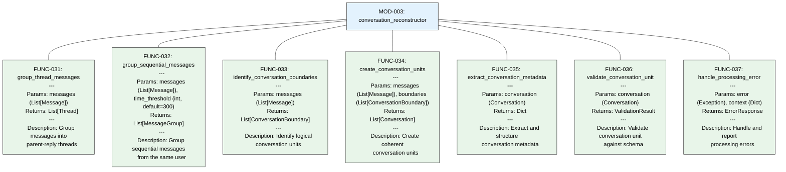

### MOD-004: embedding_service

```mermaid
flowchart TD
    classDef function fill:#e8f5e9,stroke:#333,stroke-width:1px,color:#000000
    classDef module fill:#e3f2fd,stroke:#333,stroke-width:1px,color:#000000
    
    MOD4["MOD-004: embedding_service"]
    
    F38["FUNC-038: initialize_embedding_model
    ---
    Params: model_name (string, default='text-embedding-3-small')
    Returns: EmbeddingModel
    ---
    Description: Set up the text embedding model"]
    
    F39["FUNC-039: preprocess_text
    ---
    Params: text (string)
    Returns: string
    ---
    Description: Clean and prepare text for embedding"]
    
    F40["FUNC-040: create_text_chunks
    ---
    Params: text (string), chunk_size (int=512), overlap (int=128)
    Returns: List[string]
    ---
    Description: Split text into overlapping chunks"]
    
    F41["FUNC-041: generate_embedding
    ---
    Params: text (string), model (EmbeddingModel)
    Returns: Vector
    ---
    Description: Generate embedding vector for text"]
    
    F42["FUNC-042: batch_generate_embeddings
    ---
    Params: texts (List[string]), model (EmbeddingModel)
    Returns: List[Vector]
    ---
    Description: Generate embeddings
    for multiple texts"]
    
    F43["FUNC-043: schedule_batch_processing
    ---
    Params: conversation_ids (List[string])
    Returns: ScheduledTask
    ---
    Description: Schedule batch processing
    of conversations"]
    
    F44["FUNC-044: implement_circuit_breaker
    ---
    Params: operation (Function)
    Returns: CircuitBreakerResult
    ---
    Description: Implement circuit breaker
    for external API calls"]
    
    F45["FUNC-045: handle_embedding_error
    ---
    Params: error (Exception), context (Dict)
    Returns: ErrorResponse
    ---
    Description: Handle and report
    embedding errors"]
    
    F46["FUNC-046: validate_embedding_schema
    ---
    Params: embedding (Dict)
    Returns: ValidationResult
    ---
    Description: Validate embedding data
    against schema"]
    
    MOD4 --- F38
    MOD4 --- F39
    MOD4 --- F40
    MOD4 --- F41
    MOD4 --- F42
    MOD4 --- F43
    MOD4 --- F44
    MOD4 --- F45
    MOD4 --- F46
    
    class MOD4 module
    class F38,F39,F40,F41,F42,F43,F44,F45,F46 function
```

### MOD-005: search_service

```mermaid
flowchart TD
    classDef function fill:#e8f5e9,stroke:#333,stroke-width:1px,color:#000000
    classDef module fill:#e3f2fd,stroke:#333,stroke-width:1px,color:#000000
    
    MOD5["MOD-005: search_service"]
    
    F47["FUNC-047: process_search_query
    ---
    Params: query_text (string)
    Returns: ProcessedQuery
    ---
    Description: Process and clean
    search query text"]
    
    F48["FUNC-048: convert_query_to_embedding
    ---
    Params: query_text (string)
    Returns: Vector
    ---
    Description: Convert search query
    to embedding vector"]
    
    F49["FUNC-049: apply_search_filters
    ---
    Params: results (List[SearchResult]), filters (Dict)
    Returns: List[SearchResult]
    ---
    Description: Apply channel, date, and
    other filters to results"]
    
    F50["FUNC-050: perform_search
    ---
    Params: query_text (string), filters (Dict)
    Returns: List[SearchResult]
    ---
    Description: Perform full search workflow"]
    
    F51["FUNC-051: format_search_results
    ---
    Params: results (List[SearchResult])
    Returns: List[FormattedResult]
    ---
    Description: Format results with
    context for display"]
    
    F52["FUNC-052: handle_search_error
    ---
    Params: error (Exception), context (Dict)
    Returns: ErrorResponse
    ---
    Description: Handle and report
    search errors"]
    
    F53["FUNC-053: validate_search_query
    ---
    Params: query (Dict)
    Returns: ValidationResult
    ---
    Description: Validate search query
    against schema"]
    
    F54["FUNC-054: implement_search_timeout
    ---
    Params: operation (Function), timeout_ms (int)
    Returns: TimeoutResult
    ---
    Description: Implement timeout for
    long-running searches"]
    
    MOD5 --- F47
    MOD5 --- F48
    MOD5 --- F49
    MOD5 --- F50
    MOD5 --- F51
    MOD5 --- F52
    MOD5 --- F53
    MOD5 --- F54
    
    class MOD5 module
    class F47,F48,F49,F50,F51,F52,F53,F54 function
```

### MOD-006: web_interface

```mermaid
flowchart TD
    classDef function fill:#e8f5e9,stroke:#333,stroke-width:1px,color:#000000
    classDef module fill:#e3f2fd,stroke:#333,stroke-width:1px,color:#000000
    
    MOD6["MOD-006: web_interface"]
    
    F55["FUNC-055: initialize_next_app
    ---
    Params: config (Dict)
    Returns: NextApp
    ---
    Description: Initialize Next.js application"]
    
    F56["FUNC-056: setup_authentication
    ---
    Params: auth_service (AuthService)
    Returns: boolean
    ---
    Description: Set up authentication
    with auth service"]
    
    F57["FUNC-057: create_search_interface
    ---
    Params: none
    Returns: React.Component
    ---
    Description: Create search UI component"]
    
    F58["FUNC-058: create_results_display
    ---
    Params: none
    Returns: React.Component
    ---
    Description: Create results display component"]
    
    F59["FUNC-059: handle_search_submission
    ---
    Params: query (string), filters (Dict)
    Returns: Promise<SearchResults>
    ---
    Description: Handle search form submission"]
    
    F60["FUNC-060: integrate_dashboard
    ---
    Params: dashboard_component (React.Component)
    Returns: React.Component
    ---
    Description: Integrate insights dashboard
    into web interface"]
    
    F61["FUNC-061: create_data_refresh_controls
    ---
    Params: none
    Returns: React.Component
    ---
    Description: Create UI controls for
    manually refreshing Slack data"]
    
    F62["FUNC-062: handle_user_data_refresh
    ---
    Params: none
    Returns: Promise<boolean>
    ---
    Description: Handle manual refresh of
    user profile data"]
    
    F63["FUNC-063: handle_channel_data_refresh
    ---
    Params: none
    Returns: Promise<boolean>
    ---
    Description: Handle manual refresh of
    channel information"]
    
    F64["FUNC-064: create_user_info_display
    ---
    Params: user_id (string)
    Returns: React.Component
    ---
    Description: Create component to display
    user profile information"]
    
    F65["FUNC-065: create_channel_info_display
    ---
    Params: channel_id (string)
    Returns: React.Component
    ---
    Description: Create component to display
    channel information"]
    
    F66["FUNC-066: setup_websocket_connection
    ---
    Params: config (Dict)
    Returns: WebSocketConnection
    ---
    Description: Set up WebSocket connection
    for real-time updates"]
    
    F67["FUNC-067: handle_websocket_message
    ---
    Params: message (WebSocketMessage)
    Returns: void
    ---
    Description: Handle incoming WebSocket
    messages"]
    
    F68["FUNC-068: handle_api_error
    ---
    Params: error (Error), context (Dict)
    Returns: ErrorResponse
    ---
    Description: Handle and display
    API errors gracefully"]
    
    F69["FUNC-069: implement_retry_mechanism
    ---
    Params: operation (Function), max_retries (int)
    Returns: RetryResult
    ---
    Description: Implement retry mechanism
    for failed operations"]
    
    MOD6 --- F55
    MOD6 --- F56
    MOD6 --- F57
    MOD6 --- F58
    MOD6 --- F59
    MOD6 --- F60
    MOD6 --- F61
    MOD6 --- F62
    MOD6 --- F63
    MOD6 --- F64
    MOD6 --- F65
    MOD6 --- F66
    MOD6 --- F67
    MOD6 --- F68
    MOD6 --- F69
    
    class MOD6 module
    class F55,F56,F57,F58,F59,F60,F61,F62,F63,F64,F65,F66,F67,F68,F69 function
```

### MOD-007: topic_analysis_service

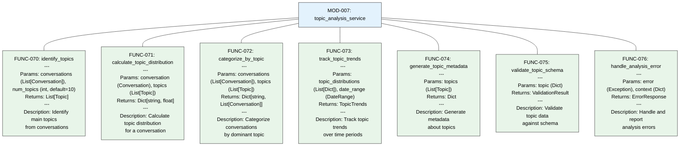

### MOD-008: insights_dashboard

```mermaid
flowchart TD
    classDef function fill:#e8f5e9,stroke:#333,stroke-width:1px,color:#000000
    classDef module fill:#e3f2fd,stroke:#333,stroke-width:1px,color:#000000
    
    MOD8["MOD-008: insights_dashboard"]
    
    F77["FUNC-077: create_topic_distribution_chart
    ---
    Params: topic_data (Dict)
    Returns: React.Component
    ---
    Description: Create topic distribution
    visualization"]
    
    F78["FUNC-078: create_activity_trend_chart
    ---
    Params: activity_data (Dict)
    Returns: React.Component
    ---
    Description: Create activity trends
    visualization"]
    
    F79["FUNC-079: create_search_integration
    ---
    Params: search_service (SearchService)
    Returns: React.Component
    ---
    Description: Create search component
    for dashboard"]
    
    F80["FUNC-080: create_filter_controls
    ---
    Params: available_filters (Dict)
    Returns: React.Component
    ---
    Description: Create filter controls
    for dashboard"]
    
    F81["FUNC-081: create_dashboard_layout
    ---
    Params: components (List[React.Component])
    Returns: React.Component
    ---
    Description: Create main dashboard
    layout with components"]
    
    F82["FUNC-082: handle_visualization_error
    ---
    Params: error (Error), context (Dict)
    Returns: ErrorResponse
    ---
    Description: Handle and display
    visualization errors"]
    
    F83["FUNC-083: setup_realtime_updates
    ---
    Params: websocket (WebSocketConnection)
    Returns: void
    ---
    Description: Set up real-time updates
    via WebSocket"]
    
    F84["FUNC-084: validate_dashboard_data
    ---
    Params: data (Dict)
    Returns: ValidationResult
    ---
    Description: Validate dashboard data
    against schema"]
    
    MOD8 --- F77
    MOD8 --- F78
    MOD8 --- F79
    MOD8 --- F80
    MOD8 --- F81
    MOD8 --- F82
    MOD8 --- F83
    MOD8 --- F84
    
    class MOD8 module
    class F77,F78,F79,F80,F81,F82,F83,F84 function
```

### MOD-009: auth_security_service

```mermaid
flowchart TD
    classDef function fill:#e8f5e9,stroke:#333,stroke-width:1px,color:#000000
    classDef module fill:#e3f2fd,stroke:#333,stroke-width:1px,color:#000000
    
    MOD9["MOD-009: auth_security_service"]
    
    F85["FUNC-085: initialize_auth_service
    ---
    Params: config (Dict)
    Returns: AuthService
    ---
    Description: Initialize authentication
    service with configuration"]
    
    F86["FUNC-086: authenticate_user
    ---
    Params: credentials (Dict)
    Returns: AuthToken or null
    ---
    Description: Authenticate user with
    provided credentials"]
    
    F87["FUNC-087: enforce_access_controls
    ---
    Params: user (User), resource (Resource)
    Returns: boolean
    ---
    Description: Check if user has access
    to requested resource"]
    
    F88["FUNC-088: encrypt_sensitive_data
    ---
    Params: data (any), key (string)
    Returns: EncryptedData
    ---
    Description: Encrypt sensitive data"]
    
    F89["FUNC-089: decrypt_data
    ---
    Params: encrypted_data (EncryptedData), key (string)
    Returns: any
    ---
    Description: Decrypt encrypted data"]
    
    F90["FUNC-090: audit_access
    ---
    Params: user (User), resource (Resource), action (string)
    Returns: boolean
    ---
    Description: Record audit log of
    data access"]
    
    F91["FUNC-091: secure_api_endpoint
    ---
    Params: endpoint (string), middleware (List[Middleware])
    Returns: SecuredEndpoint
    ---
    Description: Apply security middleware
    to API endpoint"]
    
    F92["FUNC-092: handle_security_violation
    ---
    Params: violation (SecurityViolation)
    Returns: SecurityResponse
    ---
    Description: Handle and report
    security violations"]
    
    F93["FUNC-093: implement_account_lockout
    ---
    Params: user_id (string), reason (string)
    Returns: LockoutResult
    ---
    Description: Implement account lockout
    for suspicious activity"]
    
    F94["FUNC-094: validate_security_config
    ---
    Params: config (Dict)
    Returns: ValidationResult
    ---
    Description: Validate security
    configuration"]
    
    MOD9 --- F85
    MOD9 --- F86
    MOD9 --- F87
    MOD9 --- F88
    MOD9 --- F89
    MOD9 --- F90
    MOD9 --- F91
    MOD9 --- F92
    MOD9 --- F93
    MOD9 --- F94
    
    class MOD9 module
    class F85,F86,F87,F88,F89,F90,F91,F92,F93,F94 function
```

## Shared Types

```mermaid
flowchart TD
    classDef type fill:#f3e5f5,stroke:#333,stroke-width:1px,color:#000000
    
    T1["TYPE-001: Vector
    ---
    Description: Numerical vector representation of text
    ---
    Definition: List[float]"]
    
    T2["TYPE-002: Message
    ---
    Description: Slack message with metadata
    ---
    Definition: Dictionary containing:
    • ts: string (timestamp)
    • text: string (content)
    • user: string (sender ID)
    • channel: string (channel ID)
    • thread_ts: string (optional)
    • reactions: List (optional)
    • and other metadata"]
    
    T3["TYPE-003: Thread
    ---
    Description: Collection of messages in a thread
    ---
    Definition: Dictionary containing:
    • parent: Message (thread starter)
    • replies: List[Message] (responses)
    • participants: List[string] (user IDs)
    • and thread metadata"]
    
    T4["TYPE-004: Conversation
    ---
    Description: Coherent conversation unit
    ---
    Definition: Dictionary containing:
    • id: string (unique identifier)
    • messages: List[Message] (conversation messages)
    • participants: List[string] (user IDs)
    • channel: string (channel ID)
    • start_time: string (timestamp)
    • end_time: string (timestamp)
    • topic_distribution: Dict[string, float] (optional)"]
    
    T5["TYPE-005: SearchResult
    ---
    Description: Vector search result with metadata
    ---
    Definition: Dictionary containing:
    • conversation_id: string (matched conversation)
    • similarity_score: float (match score)
    • context: string (conversation context)
    • highlight: string (matched portion)
    • metadata: Dictionary (channel, time, etc.)"]
    
    T6["TYPE-006: Topic
    ---
    Description: Identified topic from conversations
    ---
    Definition: Dictionary containing:
    • id: string (unique identifier)
    • name: string (topic name)
    • keywords: List[string] (key terms)
    • description: string (auto-generated)
    • weight: float (importance score)"]
    
    T7["TYPE-007: TopicTrends
    ---
    Description: Topic trends over time
    ---
    Definition: Dictionary containing:
    • topics: List[Topic] (tracked topics)
    • time_periods: List[string] (time periods)
    • distributions: Dict[string, List[float]] (topic weights by period)"]
    
    T8["TYPE-008: User
    ---
    Description: Slack workspace user
    ---
    Definition: Dictionary containing:
    • id: string (unique identifier)
    • name: string (username)
    • real_name: string (full name)
    • display_name: string (display name)
    • email: string (email address, if accessible)
    • is_admin: boolean (admin status)
    • is_bot: boolean (whether user is a bot)
    • profile_image: string (profile image URL)
    • timezone: string (user's timezone)
    • status_text: string (current status)
    • status_emoji: string (current status emoji)
    • updated_at: string (timestamp of last update)
    • is_active: boolean (active status)"]
    
    T9["TYPE-009: Channel
    ---
    Description: Slack channel
    ---
    Definition: Dictionary containing:
    • id: string (unique identifier)
    • name: string (channel name)
    • is_private: boolean (privacy status)
    • is_archived: boolean (archive status)
    • topic: string (channel topic)
    • purpose: string (channel purpose)
    • creator_id: string (creator user ID)
    • created_at: string (creation timestamp)
    • member_count: integer (member count)
    • last_read: string (timestamp)
    • updated_at: string (timestamp of last update)
    • is_general: boolean (whether it's the general channel)"]
    
    T10["TYPE-010: ProcessedUser
    ---
    Description: Processed user profile with additional metadata
    ---
    Definition: Dictionary containing:
    • All fields from User
    • mention_name: string (formatted name for mentions)
    • mentions_count: integer (number of times mentioned)
    • last_active: string (timestamp of last activity)
    • channels: List[string] (channel IDs user belongs to)
    • updated_at: string (timestamp of last update)"]
    
    T11["TYPE-011: ProcessedChannel
    ---
    Description: Processed channel with additional metadata
    ---
    Definition: Dictionary containing:
    • All fields from Channel
    • mention_name: string (formatted name for mentions)
    • activity_level: string (high/medium/low)
    • message_count: integer (total messages)
    • last_active: string (timestamp of last activity)
    • top_participants: List[string] (top user IDs)
    • updated_at: string (timestamp of last update)"]
    
    class T1,T2,T3,T4,T5,T6,T7,T8,T9,T10,T11 type
```

## API Endpoints

```mermaid
flowchart LR
    classDef endpoint fill:#ffecb3,stroke:#333,stroke-width:1px,color:#000000
    
    API["API Service"]
    
    E1["POST /api/auth/login
    ---
    Purpose: Authenticate user and get token
    Module: auth_security_service"]
    
    E2["GET /api/slack/status
    ---
    Purpose: Check Slack connection status
    Module: slack_data_collector"]
    
    E3["POST /api/search
    ---
    Purpose: Perform semantic search
    Module: search_service"]
    
    E4["GET /api/conversations/:id
    ---
    Purpose: Get single conversation details
    Module: data_repository"]
    
    E5["GET /api/topics
    ---
    Purpose: Get topic analysis results
    Module: topic_analysis_service"]
    
    E6["GET /api/topics/:id/conversations
    ---
    Purpose: Get conversations for a topic
    Module: topic_analysis_service"]
    
    E7["GET /api/dashboard/activity
    ---
    Purpose: Get activity statistics
    Module: data_repository"]
    
    E8["GET /api/dashboard/topics
    ---
    Purpose: Get topic distribution
    Module: topic_analysis_service"]
    
    E9["GET /api/users
    ---
    Purpose: Get all user profiles
    Module: data_repository"]
    
    E10["GET /api/users/:id
    ---
    Purpose: Get specific user profile
    Module: data_repository"]
    
    E11["GET /api/channels
    ---
    Purpose: Get all channel information
    Module: data_repository"]
    
    E12["GET /api/channels/:id
    ---
    Purpose: Get specific channel information
    Module: data_repository"]
    
    E13["POST /api/refresh/users
    ---
    Purpose: Manually refresh user data
    Module: slack_data_collector"]
    
    E14["POST /api/refresh/channels
    ---
    Purpose: Manually refresh channel data
    Module: slack_data_collector"]
    
    API --- E1
    API --- E2
    API --- E3
    API --- E4
    API --- E5
    API --- E6
    API --- E7
    API --- E8
    API --- E9
    API --- E10
    API --- E11
    API --- E12
    API --- E13
    API --- E14
    
    class E1,E2,E3,E4,E5,E6,E7,E8,E9,E10,E11,E12,E13,E14 endpoint
```

## Component Dependency Graph

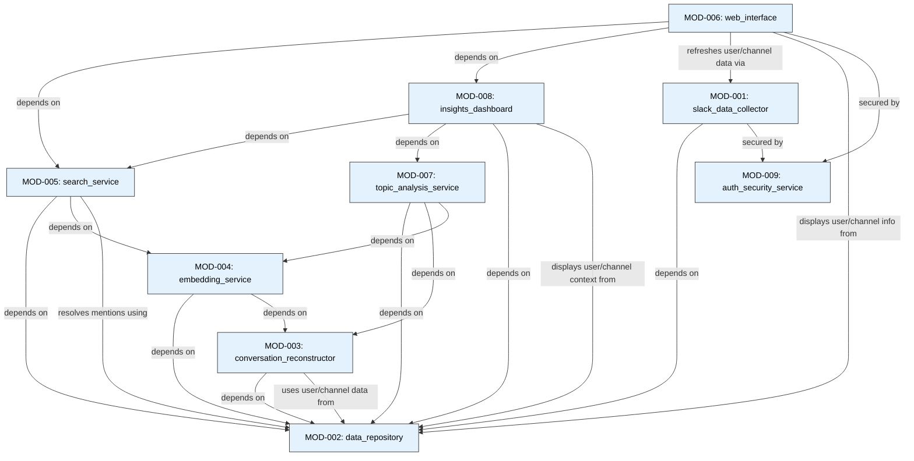