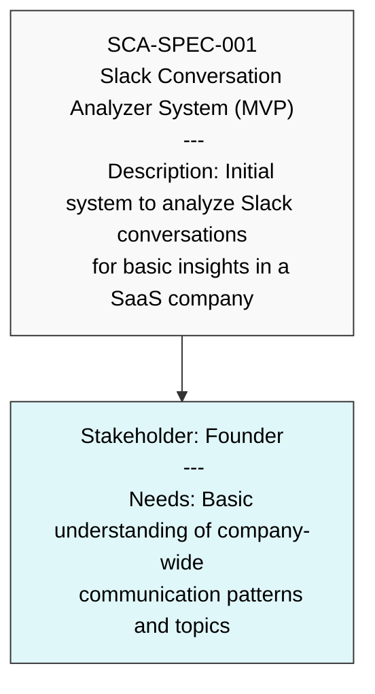
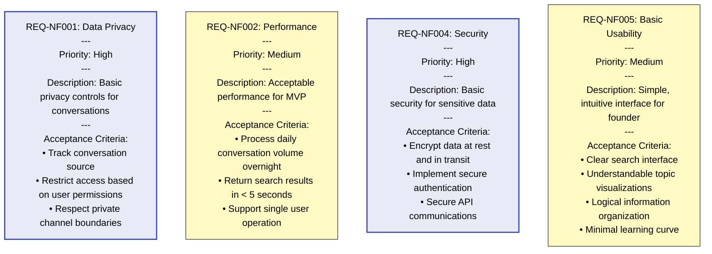
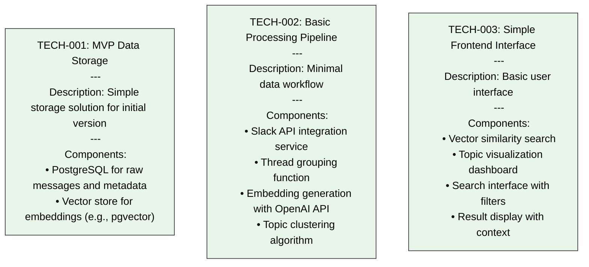

# Raw Requirements Blurb by the User/Maker

Please suggest a good strategy that I can use to collate, split and embed the slack conversations text data, happening in a saas company of size 30 people.

This overall indexing strategy should help me (as a founder of that saas company) understand what is going on in our slack  workspace, what kind of things people are talking about, what kinds of product updates we are releasing, what kinds of bugs and issues are being reported, what kind of marketing activities we are doing, what new features we are building, etc.

Assume there is a separate slack channel for different broad discussion topics like above and mostly discussions are happening in slack threads, but not always.

Please take a deep breath, and think step by step, and give all the details of how to collate slack message data into coherent conversations, how to split it, which embedding model to use to convert it into vectors, maybe have multiple vector representation to get the essence of the conversation topic at different levels, etc.

Please think deeply about it, do a deep research on it and give me the best strategy to do this with proper reasoning.

Thankyou 

# Slack Conversation Analyzer Requirements

## 1. Priority Requirements DSL

This version focuses only on the most critical requirements to implement first.

### System Specification

### Functional Requirements

```mermaid
flowchart TD
    classDef funcReq fill:#e1f5fe,stroke:#333,stroke-width:1px,color:#000000
    classDef priorityReq fill:#e8eaf6,stroke:#3949ab,stroke-width:2px,color:#000000

    F001["REQ-F001: Slack Data Collection
    ---
    Priority: High
    ---
    Description: Collect and store raw message data
    from primary Slack channels
    ---
    Acceptance Criteria:
    • Collect messages from public channels
    • Store message metadata (author, timestamp)
    • Handle rate limiting from Slack API
    • Support incremental updates
    • Process new messages at least every 15 minutes"] 
    
    F002["REQ-F002: Conversation Reconstruction
    ---
    Priority: High
    ---
    Description: Basic reconstruction of coherent conversations
    ---
    Acceptance Criteria:
    • Reconstruct thread-based conversations (parent message with all replies)
    • Group sequential messages by the same person within a defined time window
    • Maintain chronological ordering within conversation groups
    • Implement basic topic-based clustering for non-threaded messages"]
    
    F003["REQ-F003: Conversation Embedding and Indexing
    ---
    Priority: High
    ---
    Description: Generate vector embeddings for
    basic search capabilities
    ---
    Acceptance Criteria:
    • Generate embeddings at conversation level
    • Use cost-effective embedding model
    • Store embeddings efficiently"]
    
    F004["REQ-F004: Topic Analysis
    ---
    Priority: High
    ---
    Description: Basic identification of common topics
    across conversations
    ---
    Acceptance Criteria:
    • Identify main topics without predefined categories
    • Show basic topic distribution across channels
    • Categorize discussions (product, bugs, marketing, etc.)
    • Support simple visualization of topic trends"]
    
    F005["REQ-F005: Basic Semantic Search
    ---
    Priority: High
    ---
    Description: Simple search functionality for conversations
    ---
    Acceptance Criteria:
    • Return relevant results based on embeddings
    • Filter by channel and date range
    • Display conversation context"]

    F006["REQ-F006: Basic Insights Dashboard
    ---
    Priority: High
    ---
    Description: Simple visualization interface for
    conversation insights and search
    ---
    Acceptance Criteria:
    • Provide search interface for conversation discovery
    • Display topic distribution across channels
    • Show basic activity trends over time
    • Support simple filtering by channel and date
    • Present conversation context in search results"]
    
    F007["REQ-F007: Slack User Information Storage
    ---
    Priority: Medium
    ---
    Description: Store and maintain Slack workspace user profiles
    for resolving user mentions in messages
    ---
    Acceptance Criteria:
    • Collect and store user profiles (ID, name, display name, etc.)
    • Update user information at lower frequency than messages (daily)
    • Support resolving user mentions (@username) in messages
    • Allow manual refresh of user data via dashboard
    • Display user information in conversation context"]
    
    F008["REQ-F008: Slack Channel Information Storage
    ---
    Priority: Medium
    ---
    Description: Store and maintain Slack channel information
    for resolving channel mentions in messages
    ---
    Acceptance Criteria:
    • Collect and store channel details (ID, name, topic, purpose)
    • Update channel information at lower frequency than messages (daily)
    • Support resolving channel mentions (#channel) in messages
    • Allow manual refresh of channel data via dashboard
    • Display channel context in conversation view"]
    
    F001 -->|"dependency"| F002
    F001 -->|"dependency"| F007
    F001 -->|"dependency"| F008
    F002 -->|"dependency"| F003
    F003 -->|"dependency"| F004
    F003 -->|"dependency"| F005
    F004 -->|"enhances"| F005
    F004 -->|"feeds"| F006
    F005 -->|"used by"| F006
    F007 -->|"enhances"| F002
    F007 -->|"used by"| F006
    F008 -->|"enhances"| F002
    F008 -->|"used by"| F006
    
    class F001,F002,F003,F004,F005,F006,F007,F008 funcReq
    class F001,F002,F003,F004,F005,F006 priorityReq
```

### Non-Functional Requirements

### Initial Technical Approach

## Implementation Strategy Notes

For initial development, focus on the Priority Requirement DSL, which includes:

1. **Basic data collection** from public Slack channels
2. **Conversation reconstruction** for coherent conversation units
3. **Vector embeddings** for semantic understanding
4. **Topic analysis** for content categorization
5. **Simple search interface** for finding relevant discussions
6. **Basic insights dashboard** for visualization and interaction
7. **Core privacy and security** to protect sensitive data

This approach allows you to:
- Get a functional system faster
- Validate the overall approach before extensive development
- Start getting value from conversation analysis
- Gather user feedback for future iterations

Once the initial system is working, you can progressively implement more requirements from the Full Requirement DSL based on user feedback and business needs.