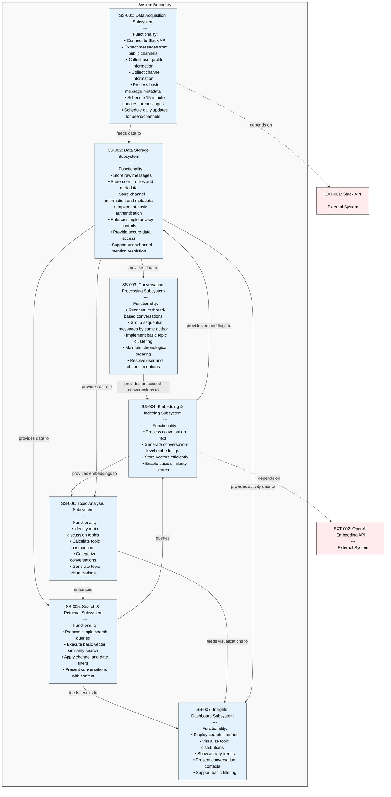
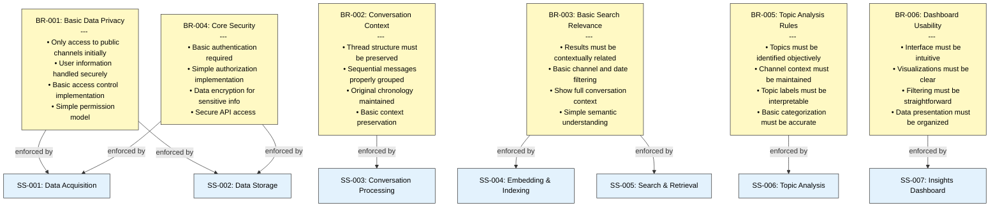
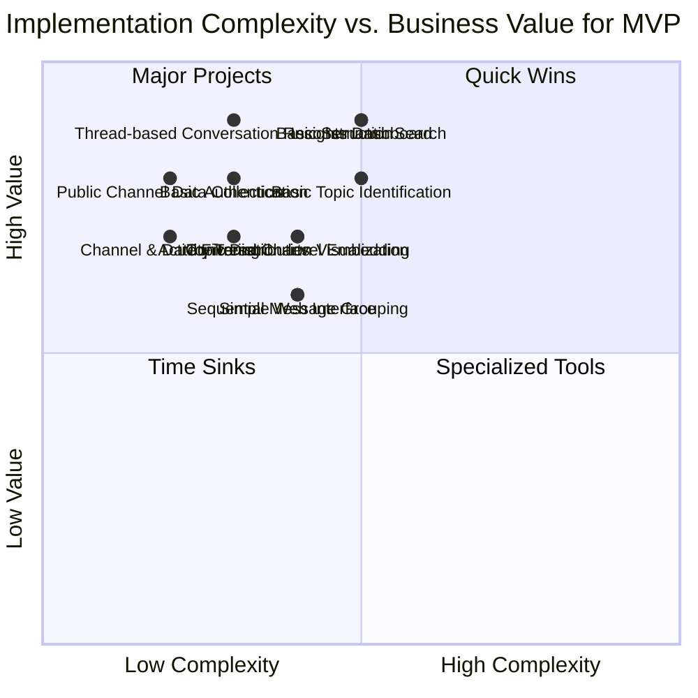
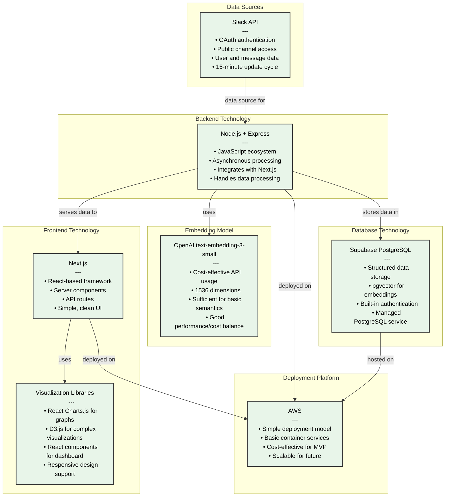
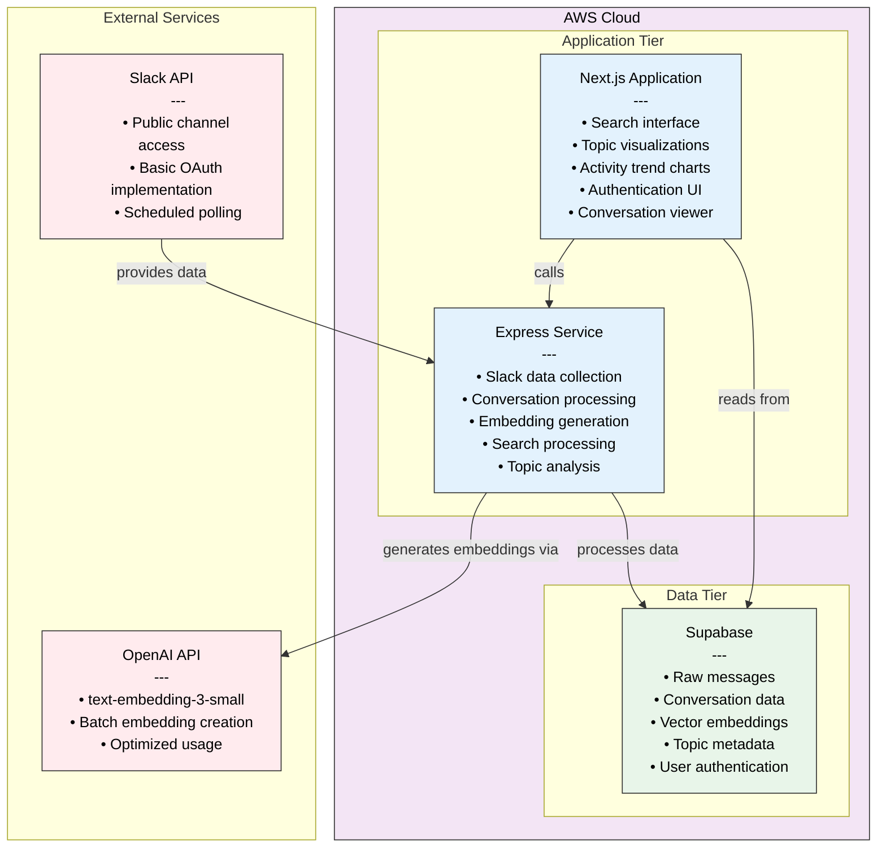
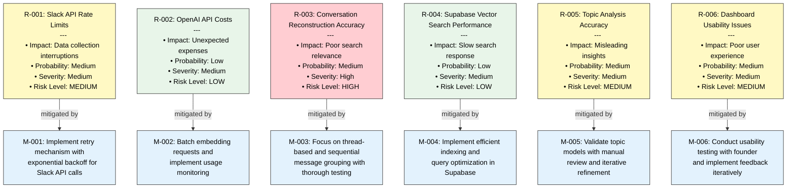
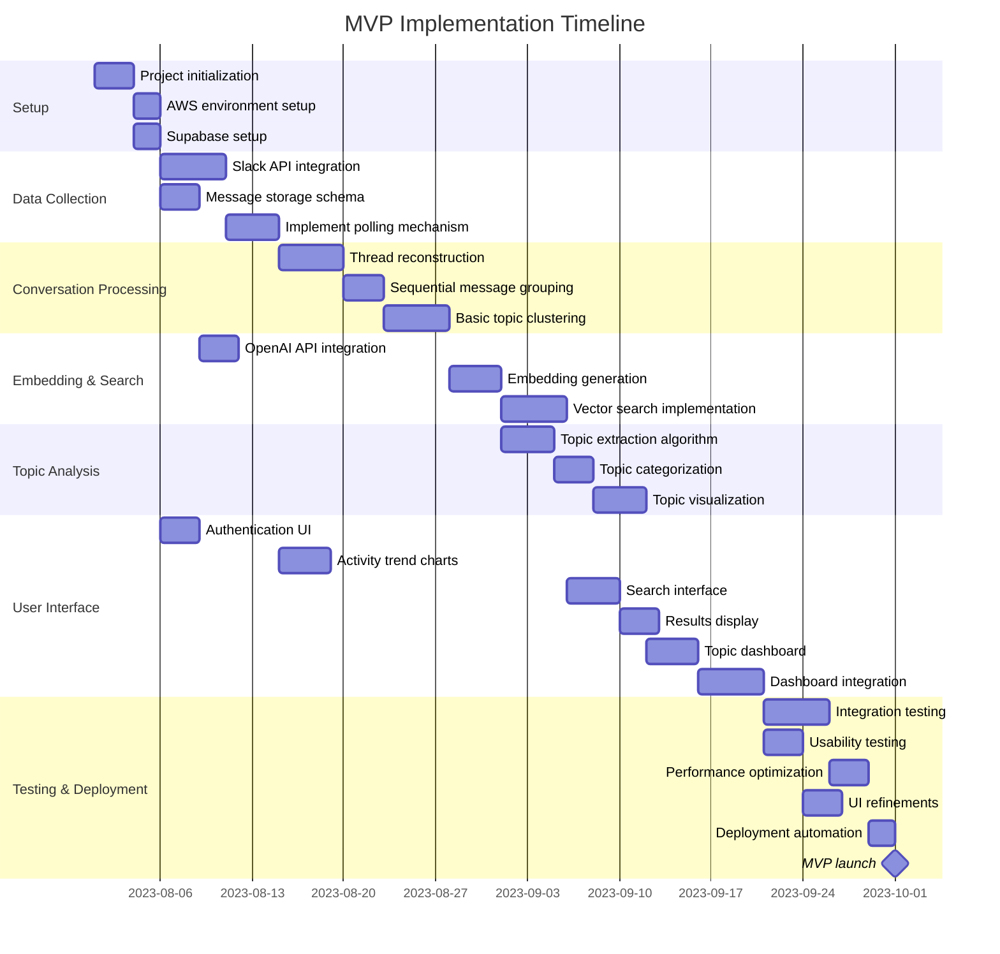

# System Analysis DSL (SysDSL) for Priority Requirements MVP

This DSL bridges the gap between priority requirements (from ReqDSL) and MVP architecture (ArchDSL) by analyzing feasibility, defining business rules, identifying dependencies, and establishing technical constraints for the initial implementation.

## 1. MVP Subsystem Breakdown

## 2. Priority Requirement-to-Subsystem Mapping

```mermaid
flowchart TD
    classDef subSystem fill:#e3f2fd,stroke:#333,stroke-width:1px,color:#000000
    classDef funcReq fill:#e1f5fe,stroke:#333,stroke-width:1px,color:#000000
    classDef nonFuncReq fill:#fff9c4,stroke:#333,stroke-width:1px,color:#000000

    SS1["SS-001: Data Acquisition"]
    SS2["SS-002: Data Storage"]
    SS3["SS-003: Conversation Processing"]
    SS4["SS-004: Embedding & Indexing"]
    SS5["SS-005: Search & Retrieval"]
    SS6["SS-006: Topic Analysis"]
    SS7["SS-007: Insights Dashboard"]
    
    F001["REQ-F001: Slack Data Collection"]
    F002["REQ-F002: Conversation Reconstruction"]
    F003["REQ-F003: Conversation Embedding and Indexing"]
    F004["REQ-F004: Topic Analysis"]
    F005["REQ-F005: Basic Semantic Search"]
    F006["REQ-F006: Basic Insights Dashboard"]
    F007["REQ-F007: Slack User Information Storage"]
    F008["REQ-F008: Slack Channel Information Storage"]
    
    NF001["REQ-NF001: Data Privacy"]
    NF002["REQ-NF002: Performance"]
    NF004["REQ-NF004: Security"]
    NF005["REQ-NF005: Basic Usability"]
    
    F001 -->|"implemented by"| SS1
    F002 -->|"implemented by"| SS3
    F003 -->|"implemented by"| SS4
    F004 -->|"implemented by"| SS6
    F005 -->|"implemented by"| SS5
    F006 -->|"implemented by"| SS7
    F007 -->|"implemented by"| SS1
    F007 -->|"stored by"| SS2
    F008 -->|"implemented by"| SS1
    F008 -->|"stored by"| SS2
    
    NF001 -->|"enforced by"| SS2
    NF002 -->|"addressed by"| SS2
    NF002 -->|"addressed by"| SS4
    NF002 -->|"addressed by"| SS6
    NF004 -->|"enforced by"| SS1
    NF004 -->|"enforced by"| SS2
    NF005 -->|"enforced by"| SS7
    
    class SS1,SS2,SS3,SS4,SS5,SS6,SS7 subSystem
    class F001,F002,F003,F004,F005,F006,F007,F008 funcReq
    class NF001,NF002,NF004,NF005 nonFuncReq
```

## 3. MVP Data Flow Analysis

```mermaid
flowchart LR
    classDef dataObject fill:#e8f5e9,stroke:#333,stroke-width:1px,color:#000000
    classDef process fill:#e3f2fd,stroke:#333,stroke-width:1px,color:#000000
    classDef dataStore fill:#fff9c4,stroke:#333,stroke-width:1px,color:#000000
    classDef externalEntity fill:#ffebee,stroke:#333,stroke-width:1px,color:#000000

    E1["Slack
    ---
    External Entity"]
    
    P1["P1: Collect Public Channel Messages
    ---
    Process"]
    
    P2["P2: Reconstruct Conversations
    ---
    Process"]
    
    P3["P3: Generate Conversation Embeddings
    ---
    Process"]
    
    P4["P4: Process Search Queries
    ---
    Process"]
    
    P5["P5: Present Search Results
    ---
    Process"]
    
    P6["P6: Analyze Conversation Topics
    ---
    Process"]
    
    P7["P7: Generate Topic Visualizations
    ---
    Process"]
    
    P8["P8: Create Activity Trends
    ---
    Process"]
    
    P9["P9: Present Insights Dashboard
    ---
    Process"]
    
    P10["P10: Collect User Profiles
    ---
    Process"]
    
    P11["P11: Collect Channel Information
    ---
    Process"]
    
    P12["P12: Resolve Mentions
    ---
    Process"]
    
    D1["D1: Message Store
    ---
    Data Store"]
    
    D2["D2: Conversation Store
    ---
    Data Store"]
    
    D3["D3: Vector Store
    ---
    Data Store"]
    
    D4["D4: Topic Store
    ---
    Data Store"]
    
    D5["D5: User Profile Store
    ---
    Data Store"]
    
    D6["D6: Channel Information Store
    ---
    Data Store"]
    
    E2["User
    ---
    External Entity"]
    
    E3["OpenAI
    ---
    External Entity"]
    
    O1["Public Channel Messages
    ---
    Data Object"]
    
    O2["Reconstructed Conversations
    ---
    Data Object"]
    
    O3["Conversation Vectors
    ---
    Data Object"]
    
    O4["Basic Search Query
    ---
    Data Object"]
    
    O5["Filtered Search Results
    ---
    Data Object"]
    
    O6["Topic Distribution
    ---
    Data Object"]
    
    O7["Topic Visualizations
    ---
    Data Object"]
    
    O8["Activity Data
    ---
    Data Object"]
    
    O9["Insights Dashboard View
    ---
    Data Object"]
    
    O10["User Profiles
    ---
    Data Object"]
    
    O11["Channel Information
    ---
    Data Object"]
    
    E1 -->|"public messages"| P1
    E1 -->|"user profiles"| P10
    E1 -->|"channel information"| P11
    P1 -->|"raw messages"| O1
    O1 -->|"stored in"| D1
    O1 -->|"processed by"| P2
    P2 -->|"conversations"| O2
    O2 -->|"stored in"| D2
    O2 -->|"processed by"| P3
    P3 -->|"generates"| O3
    E3 -->|"embedding model"| P3
    O3 -->|"stored in"| D3
    O2 -->|"analyzed by"| P6
    O3 -->|"used by"| P6
    P6 -->|"produces"| O6
    O6 -->|"stored in"| D4
    O6 -->|"visualized by"| P7
    P7 -->|"generates"| O7
    D1 -->|"analyzed for"| P8
    P8 -->|"generates"| O8
    E2 -->|"interacts with"| P9
    P9 -->|"presents"| O9
    E2 -->|"submits"| O4
    O4 -->|"processed by"| P4
    P4 -->|"queries"| D3
    P4 -->|"retrieves from"| D2
    P4 -->|"uses"| D4
    P4 -->|"generates"| O5
    O5 -->|"presented by"| P5
    O7 -->|"used in"| P9
    O8 -->|"used in"| P9
    O5 -->|"presented in"| P9
    P5 -->|"displays to"| E2
    O9 -->|"viewed by"| E2
    P10 -->|"processes"| O10
    O10 -->|"stored in"| D5
    P11 -->|"processes"| O11
    O11 -->|"stored in"| D6
    D5 -->|"used by"| P12
    D6 -->|"used by"| P12
    P12 -->|"enhances"| P2
    P12 -->|"enhances"| P5
    E2 -->|"manually refreshes"| P10
    E2 -->|"manually refreshes"| P11
    
    class E1,E2,E3 externalEntity
    class P1,P2,P3,P4,P5,P6,P7,P8,P9,P10,P11,P12 process
    class D1,D2,D3,D4,D5,D6 dataStore
    class O1,O2,O3,O4,O5,O6,O7,O8,O9,O10,O11 dataObject
```

## 4. MVP Technical Constraints & Feasibility Analysis

```mermaid
flowchart TD
    classDef constraint fill:#ffebee,stroke:#333,stroke-width:1px,color:#000000
    classDef assumption fill:#e0f7fa,stroke:#333,stroke-width:1px,color:#000000
    classDef feasibility fill:#e8f5e9,stroke:#333,stroke-width:1px,color:#000000
    
    subgraph TC["Technical Constraints"]
        TC1["TC-001: Slack API Rate Limits
        ---
        • Tier 2: 20+ requests/min
        • Public channel data only for MVP
        • OAuth authentication required"]
        
        TC2["TC-002: OpenAI text-embedding-3-small Limitations
        ---
        • 1536 dimensions for embeddings
        • 8,191 token maximum per API call
        • Cost considerations for volume"]
        
        TC3["TC-003: Supabase + pgvector Performance
        ---
        • Vector search performance constraints
        • Connection pooling limitations
        • Storage scaling considerations"]
        
        TC4["TC-004: MVP Security Requirements
        ---
        • Basic encryption requirements
        • Authentication via Supabase
        • Simple row-level security"]
        
        TC5["TC-005: Topic Analysis Constraints
        ---
        • Limited statistical techniques for MVP
        • Basic clustering algorithms only
        • Simple visualization capabilities"]
        
        TC6["TC-006: Dashboard Responsiveness
        ---
        • Limited interactivity for MVP
        • Basic filtering capabilities
        • Simple visualization components
        • Initial page load performance"]
    end
    
    subgraph AS["System Assumptions"]
        AS1["AS-001: Initial Data Volume
        ---
        • Small company (30 employees)
        • ~10-15 active public channels
        • Modest daily message volume"]
        
        AS2["AS-002: Message Distribution
        ---
        • ~70% of discussions in threads
        • ~20% in sequential messages
        • ~10% scattered conversations"]
        
        AS3["AS-003: Initial Usage Pattern
        ---
        • Single founder/admin user initially
        • Basic search functionality needs
        • Daily data update frequency acceptable"]
        
        AS4["AS-004: Topic Distribution
        ---
        • ~5-10 main topics across channels
        • Most channels have 2-3 primary topics
        • Topics evolve gradually over time"]
        
        AS5["AS-005: User Interaction
        ---
        • Primarily desktop usage
        • Daily usage for insights
        • Preference for visual data
        • Simple filtering needs"]
    end
    
    subgraph FA["Feasibility Assessment"]
        FA1["FA-001: Public Channel Data Collection
        ---
        • FEASIBLE with 15-minute intervals
        • ACHIEVABLE with simple OAuth flow
        • MANAGEABLE API rate limits"]
        
        FA2["FA-002: Basic Conversation Reconstruction
        ---
        • FEASIBLE for thread reconstruction
        • ACHIEVABLE for sequential messages
        • IMPLEMENTABLE for basic clustering"]
        
        FA3["FA-003: Conversation-level Embeddings
        ---
        • FEASIBLE with text-embedding-3-small
        • EFFICIENT for conversation-level only
        • COST-EFFECTIVE with batching"]
        
        FA4["FA-004: Basic Search Functionality
        ---
        • FEASIBLE with pgvector extension
        • ACHIEVABLE performance for MVP scale
        • REASONABLE response times (<5s)"]
        
        FA5["FA-005: Topic Analysis
        ---
        • FEASIBLE using embedding clusters
        • ACHIEVABLE with simple algorithms
        • REASONABLE accuracy for main topics"]
        
        FA6["FA-006: Insights Dashboard
        ---
        • FEASIBLE with Next.js components
        • ACHIEVABLE with simple charts
        • REASONABLE performance for MVP scale"]
    end
    
    TC1 -->|"impacts"| FA1
    TC2 -->|"impacts"| FA3
    TC2 -->|"impacts"| FA5
    TC3 -->|"impacts"| FA4
    TC5 -->|"impacts"| FA5
    TC6 -->|"impacts"| FA6
    AS1 -->|"influences"| FA1
    AS1 -->|"influences"| FA3
    AS1 -->|"influences"| FA4
    AS2 -->|"influences"| FA2
    AS4 -->|"influences"| FA5
    AS5 -->|"influences"| FA6
    
    class TC1,TC2,TC3,TC4,TC5,TC6 constraint
    class AS1,AS2,AS3,AS4,AS5 assumption
    class FA1,FA2,FA3,FA4,FA5,FA6 feasibility
```

## 5. MVP Business Rules

## 6. MVP Implementation Complexity Analysis

## 7. Selected Technology Stack

## 8. MVP Integration Architecture

## 9. MVP Risk Assessment

## 10. MVP Implementation Plan

This system analysis serves as a bridge between the priority requirements and architecture, focusing on the immediate MVP implementation needs while ensuring a solid foundation for future expansion. 