# Enhanced Visual Representations of Slack Analyzer DSLs

This document contains detailed visual representations of the Domain-Specific Languages (DSLs) defined for the Slack Conversation Analyzer system.

## 1. Requirements DSL (ReqDSL)

### System Specification

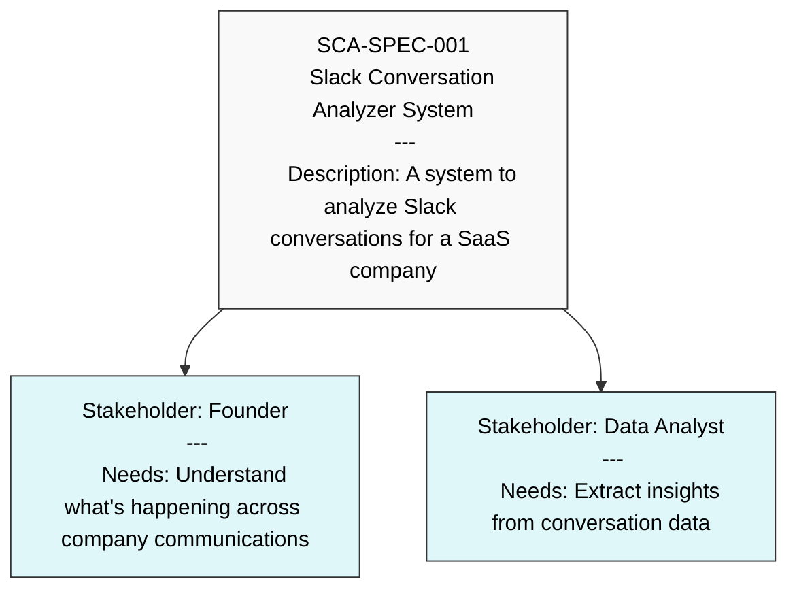

### Functional Requirements

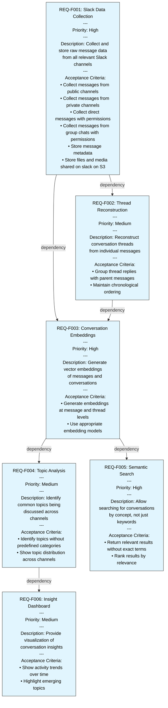

### Non-Functional Requirements

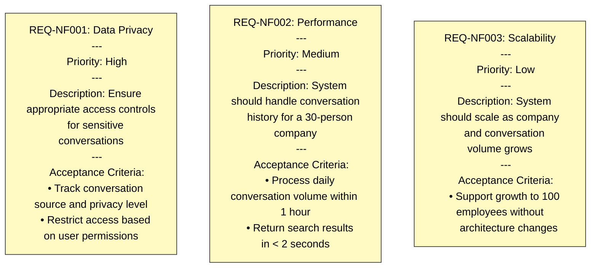

## 2. Architecture DSL (ArchDSL)

### Component Diagram

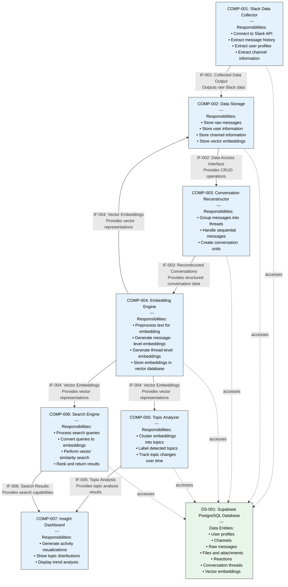

### Component-to-Requirement Fulfillment

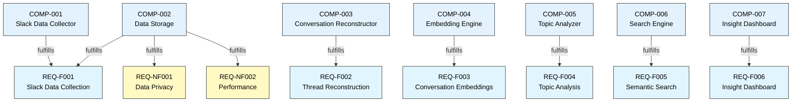

## 3. Functional DSL (FuncDSL)

### Module Structure

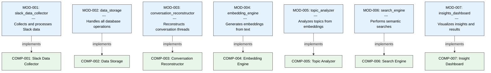

### Module Functions (Detailed Examples)

```mermaid
flowchart TD
    classDef function fill:#e8f5e9,stroke:#333,stroke-width:1px,color:#000000
    classDef module fill:#e3f2fd,stroke:#333,stroke-width:1px,color:#000000
    
    MOD1["MOD-001: slack_data_collector"]
    
    F1["FUNC-001: initialize_client
    ---
    Params: slack_token (string)
    Returns: SlackClient
    ---
    Description: Set up authenticated
    Slack API client"]
    
    F2["FUNC-002: fetch_channel_history
    ---
    Params: channel_id (string), limit (int, default=1000)
    Returns: List[Message]
    ---
    Description: Retrieve message history
    for a channel"]
    
    F3["FUNC-003: fetch_all_channels
    ---
    Params: types (string, default='public_channel,private_channel')
    Returns: List[Channel]
    ---
    Description: Retrieve all accessible channels"]
    
    F4["FUNC-004: fetch_users
    ---
    Params: none
    Returns: List[User]
    ---
    Description: Retrieve all workspace users"]
    
    F5["FUNC-005: process_message_data
    ---
    Params: messages (List[Message]), channel_id (string)
    Returns: List[ProcessedMessage]
    ---
    Description: Process and transform
    raw message data"]
    
    MOD4["MOD-004: embedding_engine"]
    
    F17["FUNC-017: initialize_embedding_model
    ---
    Params: model_name (string, default='text-embedding-3-small')
    Returns: EmbeddingModel
    ---
    Description: Set up the text embedding model"]
    
    F18["FUNC-018: preprocess_text
    ---
    Params: text (string)
    Returns: string
    ---
    Description: Clean and prepare text for embedding"]
    
    F19["FUNC-019: create_text_chunks
    ---
    Params: text (string), chunk_size (int=512), overlap (int=128)
    Returns: List[string]
    ---
    Description: Split text into overlapping chunks"]
    
    F20["FUNC-020: generate_embedding
    ---
    Params: text (string), model (EmbeddingModel)
    Returns: Vector
    ---
    Description: Generate embedding vector for text"]
    
    F21["FUNC-021: batch_generate_embeddings
    ---
    Params: texts (List[string]), model (EmbeddingModel)
    Returns: List[Vector]
    ---
    Description: Generate embeddings
    for multiple texts"]
    
    MOD1 --- F1
    MOD1 --- F2
    MOD1 --- F3
    MOD1 --- F4
    MOD1 --- F5
    
    MOD4 --- F17
    MOD4 --- F18
    MOD4 --- F19
    MOD4 --- F20
    MOD4 --- F21
    
    class MOD1,MOD4 module
    class F1,F2,F3,F4,F5,F17,F18,F19,F20,F21 function
```

### Shared Types (With Complete Definitions)

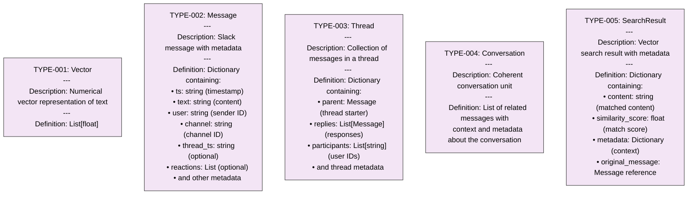

## 4. Code Mapping DSL (CodeDSL)

### File Structure with Implementation Details

```mermaid
flowchart TD
    classDef folder fill:#e8f5e9,stroke:#333,stroke-width:1px,color:#000000
    classDef file fill:#f1f8e9,stroke:#333,stroke-width:1px,color:#000000
    classDef module fill:#e3f2fd,stroke:#333,stroke-width:1px,color:#000000

    App["/app
    ---
    Main application directory"]
    SC["/slack_collector
    ---
    Slack data collection module
    Implements MOD-001"]
    DB["/database
    ---
    Database access layer
    Implements MOD-002"]
    Conv["/conversation
    ---
    Conversation processing
    Implements MOD-003"]
    Emb["/embedding
    ---
    Text embedding generation
    Implements MOD-004"]
    Top["/topics
    ---
    Topic analysis
    Implements MOD-005"]
    Search["/search
    ---
    Semantic search functionality
    Implements MOD-006"]
    Dash["/dashboard
    ---
    Insights dashboard
    Implements MOD-007"]
    Utils["/utils
    ---
    Shared utility functions"]
    
    App --> SC
    App --> DB
    App --> Conv
    App --> Emb
    App --> Top
    App --> Search
    App --> Dash
    App --> Utils
    
    SC --> Client["client.py
    ---
    Slack API client implementation
    Implements FUNC-001: initialize_client"]
    SC --> Collector["collector.py
    ---
    Data collection functions
    Implements FUNC-002/003/004/005"]
    
    DB --> Connection["connection.py
    ---
    Database connection management
    Implements FUNC-006"]
    DB --> Storage["storage.py
    ---
    Data storage operations
    Implements FUNC-007/008/009/010"]
    DB --> VectorStore["vector_store.py
    ---
    Vector storage and retrieval
    Implements FUNC-011/012"]
    
    Conv --> Reconstruct["reconstruction.py
    ---
    Thread and conversation reconstruction
    Implements FUNC-013/014/015/016"]
    
    Emb --> Models["models.py
    ---
    Embedding model configuration
    Implements FUNC-017"]
    Emb --> Processor["processor.py
    ---
    Text preprocessing for embeddings
    Implements FUNC-018/019"]
    Emb --> Generator["generator.py
    ---
    Embedding generation functions
    Implements FUNC-020/021"]
    
    Top --> Clustering["clustering.py
    ---
    Embedding clustering
    Implements FUNC-022/023"]
    Top --> Labeling["labeling.py
    ---
    Topic labeling
    Implements FUNC-024"]
    Top --> Evolution["evolution.py
    ---
    Topic evolution tracking
    Implements FUNC-025"]
    
    Search --> Query["query.py
    ---
    Query processing
    Implements FUNC-026/027"]
    Search --> Engine["engine.py
    ---
    Search execution
    Implements FUNC-028/029"]
    
    Dash --> Charts["charts.py
    ---
    Chart generation
    Implements FUNC-030/031/033"]
    Dash --> Results["results.py
    ---
    Search result formatting
    Implements FUNC-032"]
    
    Utils --> Types["types.py
    ---
    Shared type definitions
    Implements TYPE-001/002/003/004/005"]
    
    class App,SC,DB,Conv,Emb,Top,Search,Dash,Utils folder
    class Client,Collector,Connection,Storage,VectorStore,Reconstruct,Models,Processor,Generator,Clustering,Labeling,Evolution,Query,Engine,Charts,Results,Types file
```

### Code Fragment Example

```mermaid
flowchart TD
    classDef code fill:#f5f5f5,stroke:#333,stroke-width:1px,color:#000000
    
    FRAG1["FRAG-001
    ---
    File: /app/slack_collector/client.py
    Implements: FUNC-001"]
    
    CODE1["def initialize_client(slack_token):
        \"\"\"Set up authenticated Slack API client\"\"\"
        from slack_sdk import WebClient
        return WebClient(token=slack_token)"]
    
    FRAG3["FRAG-003
    ---
    File: /app/database/vector_store.py
    Implements: FUNC-012"]
    
    CODE3["def query_vector_similarity(query_vector, 
                                filter_conditions=None, 
                                limit=10, 
                                connection=None):
        \"\"\"Find similar vectors using cosine similarity\"\"\"
        conn = connection or initialize_db_connection(...)
        
        # Base query
        query = \"SELECT id, content, metadata, 
                embedding <-> :query AS distance\"
        params = {\"query\": query_vector}
        
        # Add filters if provided
        if filter_conditions:
            where_clauses = []
            for key, value in filter_conditions.items():
                where_clauses.append(f\"metadata->>'{key}' = :filter_{i}\")
            
            query += \" WHERE \" + \" AND \".join(where_clauses)
        
        # Return results
        return conn.query(query, params).execute().data"]
    
    FRAG1 --- CODE1
    FRAG3 --- CODE3
    
    class FRAG1,FRAG3 code
    class CODE1,CODE3 code
```

## 5. Deployment DSL (DeployDSL)

### Environment Configuration

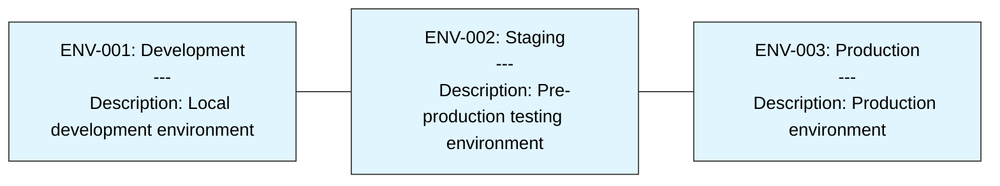

### Infrastructure Components with Configuration

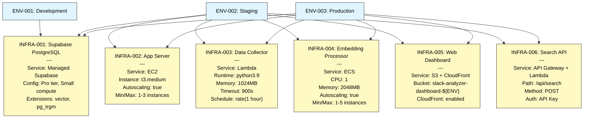

### Service Deployment Details

```mermaid
flowchart TD
    classDef service fill:#e8f5e9,stroke:#333,stroke-width:1px,color:#000000
    classDef infra fill:#fff9c4,stroke:#333,stroke-width:1px,color:#000000
    classDef component fill:#e3f2fd,stroke:#333,stroke-width:1px,color:#000000

    S1["SVC-001: slack-collector-service
    ---
    Type: Scheduled Lambda Function
    Docker: slack-analyzer/collector:latest
    Env Vars: SLACK_BOT_TOKEN, SUPABASE_URL, SUPABASE_KEY"]
    
    S2["SVC-002: embedding-service
    ---
    Type: Container Service
    Docker: slack-analyzer/embedding:latest
    Env Vars: OPENAI_API_KEY, SUPABASE_URL, SUPABASE_KEY"]
    
    S3["SVC-003: analysis-service
    ---
    Type: EC2 Application
    Systemd Service: slack-analyzer
    Docker Compose: true
    Env Vars: SUPABASE_URL, SUPABASE_KEY"]
    
    S4["SVC-004: search-api-service
    ---
    Type: API Gateway Lambda
    Docker: slack-analyzer/search-api:latest
    Env Vars: SUPABASE_URL, SUPABASE_KEY"]
    
    S5["SVC-005: dashboard-ui
    ---
    Type: Static Website
    Build Command: npm run build
    Source: /dashboard
    Output: /dashboard/build
    Env Vars: REACT_APP_API_URL"]
    
    C1["COMP-001: Slack Data Collector"]
    C4["COMP-004: Embedding Engine"]
    C3_5["COMP-003/005: Conversation Reconstructor & Topic Analyzer"]
    C6["COMP-006: Search Engine"]
    C7["COMP-007: Insight Dashboard"]
    
    I3["INFRA-003: Lambda Data Collector"]
    I4["INFRA-004: ECS Embedding Processor"]
    I2["INFRA-002: EC2 App Server"]
    I6["INFRA-006: API Gateway + Lambda"]
    I5["INFRA-005: S3 + CloudFront"]
    
    S1 -->|"implements"| C1
    S2 -->|"implements"| C4
    S3 -->|"implements"| C3_5
    S4 -->|"implements"| C6
    S5 -->|"implements"| C7
    
    S1 -->|"deployed to"| I3
    S2 -->|"deployed to"| I4
    S3 -->|"deployed to"| I2
    S4 -->|"deployed to"| I6
    S5 -->|"deployed to"| I5
    
    class S1,S2,S3,S4,S5 service
    class C1,C4,C3_5,C6,C7 component
    class I3,I4,I2,I6,I5 infra
```

### CI/CD Workflow with Steps

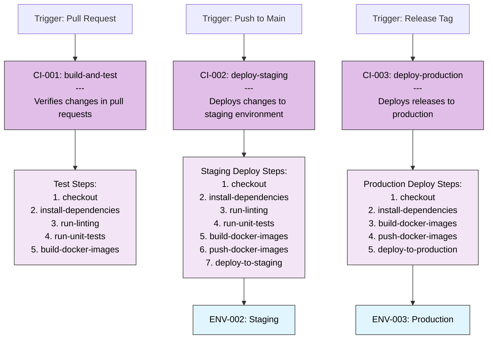

These enhanced diagrams provide a more detailed visual representation of the Slack Analyzer system, including descriptions, responsibilities, configurations, and other important details from the original textual DSLs.
